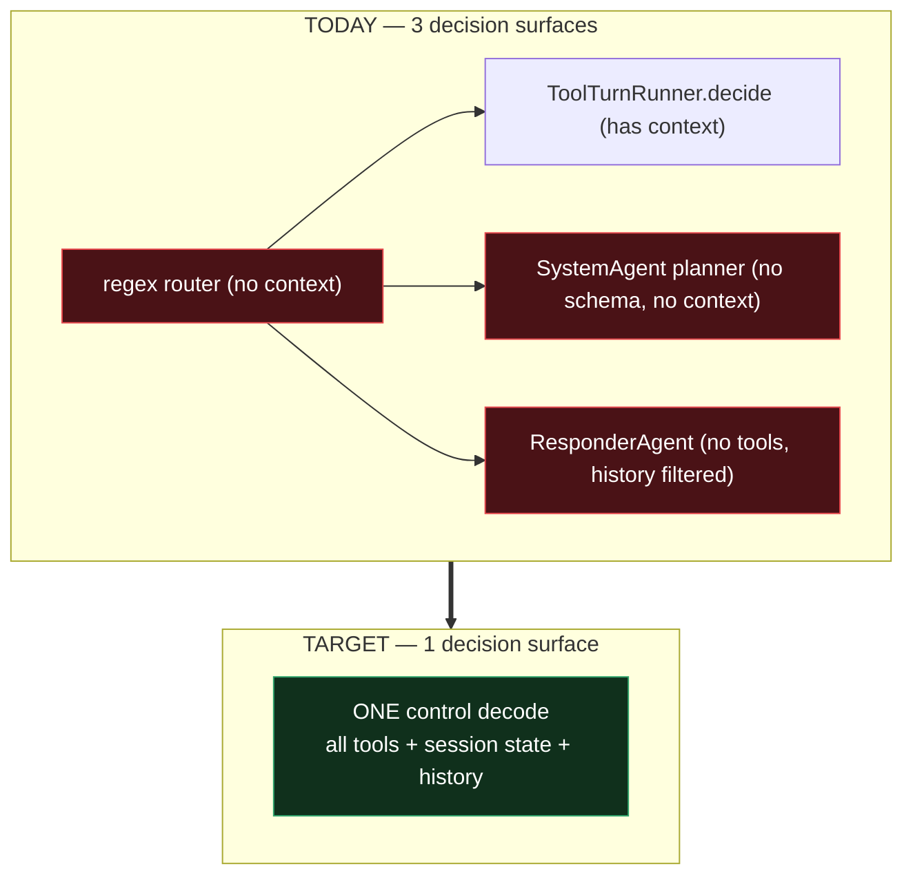

# 12 — Implementation guide: unified control decode

**For:** an implementing agent with no prior knowledge of this codebase.
**Status of this document:** every code reference below was verified by reading
the file. Anything unverified is explicitly marked **[ASK]**.
**Companions (read only if you need the *why*):** `docs/11-…` explains the
problem; `docs/10-…` is the design rationale. **You should not need either to
complete this work.**

---

# Part 0 — Read this first

## 0.1 What you are building, in four sentences

Veda is a local voice/chat assistant on a Raspberry Pi 5 running one Qwen3-4B
Q4 model via llama.cpp. Today a **regex router** picks which agent handles a
turn, *then* the model picks a tool — two decisions, and the first one cannot
see the conversation. You are deleting the first decision so there is exactly
**one** model decision per turn that sees the conversation, the session state and
every tool. Nothing about skills, HTTP egress, permissions or persistence changes.

## 0.2 Rules of engagement — follow these literally

| # | Rule |
|---|---|
| 1 | **Do not explore the codebase.** §0.3 lists every file you need and when. Reading beyond it wastes tokens and risks acting on stale assumptions. |
| 2 | **Do not re-derive the analysis.** It is done. If you think the design is wrong, say so and stop — do not improvise. |
| 3 | **Do Part 1 (pre-flight) first.** It is ~10 minutes and it protects you from codebase drift. |
| 4 | **One phase at a time.** Do not start phase *N+1* until phase *N*'s "Done when" passes. |
| 5 | **Change nothing this document does not ask for.** No refactors, no renames, no style fixes, no added type hints on code you did not write. |
| 6 | **If reality contradicts this document, STOP and report.** Do not guess. |
| 7 | **Never delete code in a phase that does not say "delete".** Deletions are concentrated in Phase 3 and Part 4. |
| 8 | **Keep both paths alive until Phase 6.** Everything is behind `orchestrator_enabled`. |

## 0.3 The reading list — the only files you may open

Read a file at the phase that needs it, not before.

| Phase | Read | Why |
|---|---|---|
| Pre-flight | the 9 files in Part 1 | confirm no drift |
| 0 | `tests/eval/golden_set.yaml`, `tests/test_golden_routing.py`, `src/domain/entities/turn_trace.py`, `src/tpa/persistence/repositories/trace_repository.py` | baseline + observability |
| 1 | `src/domain/entities/agent_context.py`, `src/schemas/chat.py`, `src/controller/routes/chat.py`, `src/controller/routes/stream.py`, `src/service/voice/voice_session.py` (around line 414 only), `src/tpa/persistence/models/conversation.py`, `src/tpa/persistence/repositories/conversation_repository.py`, `src/server.py` (lines 780–870 only) | add session fields + new table |
| 2 | `src/domain/policies/tool_call_schema.py`, `src/service/prompting/prompt_composer.py`, `config/prompts/call_stage.md`, `src/service/agent/tool_turn_runner.py`, `src/service/agent/tool_agent.py` | build the control decode |
| 3 | `src/domain/policies/routing_policy.py`, `src/service/agent/supervisor.py`, `src/service/agent/responder.py`, `src/service/agent/system.py`, `src/service/skills/` (one existing skill, for the pattern) | deletions + system tools |
| 4 | `src/service/lookup/weather_lookup.py`, `src/service/lookup/place_resolver.py`, `config/tools/weather.yaml`, `src/service/conversation/conversation_manager.py` | forecast + bounds |
| 5 | `src/domain/entities/tool_manifest.py`, the YAML manifest loader, `src/domain/policies/grounding_policy.py` | data plane |

**Do not** open: `src/service/memory/*`, `src/service/conversation/summariser.py`,
`config/embedding.yaml`, the vector store, the voice pipeline beyond line 414,
or anything under `src/service/sensing/`. They are out of scope and unchanged.

## 0.4 Things I could not verify — **[ASK] the user before relying on these**

| # | Unknown | Why it matters |
|---|---|---|
| A1 | `src/domain/policies/token_budget_policy.py` is excluded from my tooling. It defines `PromptBudgets` with at least `call`, `route`, `narrate`, `observation_max`, `call_history_turns: int = 2`. | **Resolved by design:** budgets become configuration (§2.1b). You do not need me to know the current numbers — you copy them out of the dataclass into YAML verbatim. |
| A3 | `SystemControlPort` signatures | **Resolved** — verified and reproduced in §3.5. |
| A2 | The YAML→`ToolManifest` loader lives in `src/tpa/filestore/yaml_tool_manifest_store.py` (name seen in imports). I have not read it. | Phase 5 adds three manifest fields; you must extend the loader. |
| A3 | `SystemControlPort` signatures | **Resolved** — verified and reproduced in §3.5. |
| A4 | Whether `tests/eval/golden_set.yaml` on your copy already contains the "unified control decode cases" section. | **Resolved:** assume it does **not**. Phase 0 below contains the full content to add. Check first; skip if present. |
| A5 | `config/tools/tasks.yaml`, `currency.yaml`, `web_search.yaml` contents. | Needed only to mark `destructive:` correctly in Phase 4. |

---

# Part 1 — Pre-flight (MANDATORY)

Run these checks before writing any code. **If any fails, STOP and report which
one.** Your codebase may be older than the one this document was written against.

| # | File | Assert |
|---|---|---|
| P1 | `config/inference.yaml` | contains `n_ctx: 4096` and `prompt_cache_mb: 768` |
| P2 | `config/agents.yaml` | contains `llm_routing: false` and `tools_enabled: true` |
| P3 | `src/domain/policies/routing_policy.py` | contains functions `match_agent`, `pick_agent`, `_pick_by_triggers`, `_keywords` and a `_STOPWORDS` frozenset |
| P4 | `src/service/agent/supervisor.py` | `_pick()` contains the line `chosen = self.router.match(ctx.user_message, profiles)` |
| P5 | `src/service/agent/tool_turn_runner.py` | contains `if not calls and required:` followed by a `_decide(... min_calls=1)` call, and a module constant `_FORCE_NOTE` |
| P6 | `src/service/agent/responder.py` | contains `def _without_action_claims(self, turns):` with `kept.pop()` inside |
| P7 | `src/server.py` | around line 816 contains `claim_filter=guard.claims_action,` |
| P8 | `src/domain/policies/tool_call_schema.py` | contains `MAX_CALLS = 3`, `build_call_schema`, `build_route_schema`, `tool_args_schema` |
| P9 | `src/service/agent/system.py` | `SystemAgent.execute` calls `self.client.complete(...)` **without** a `json_schema=` argument |

Also confirm: `tests/eval/golden_set.yaml` exists and contains a line with
`I didn't ask about Singapore weather`. **If it does not, run Phase 0 first** —
it contains everything needed.

Record the baseline before changing anything:

```bash
pytest tests/test_golden_routing.py -q
python scripts/eval_tools.py
```

Save both outputs. You will compare against them after every phase.

---

# Part 2 — The target, in two pages

## 2.1 Before and after



## 2.2 The one contract that matters

Every turn runs exactly one constrained decode producing:

```json
{
  "calls": [ {"tool": "get_weather", "args": {"place": "Tokyo"}} ],
  "needs_live_data": true,
  "clarification": null
}
```

Dispatch, **in this exact order**:

| # | Condition | Action | Extra decodes |
|---|---|---|---|
| 1 | `calls` non-empty | execute them; ignore `clarification` | 0 or 1 |
| 2 | `calls` empty **and** `clarification` non-empty | reply with that string | 0 |
| 3 | `calls` empty **and** `needs_live_data == false` | hand to `ResponderAgent` | 1 |
| 4 | `calls` empty **and** `needs_live_data == true` | fixed refusal string | 0 |

`needs_live_data` means *"answering without a tool would be guessing."* It never
causes a fetch. Only `calls` fetch, only through `SkillRunner`.

## 2.3 Target components

| Component | Status |
|---|---|
| `AssistantOrchestrator` | **new** — runs every turn |
| `ResponderAgent` | kept; reached only via dispatch row 3 |
| `SupervisorAgent`, `ToolAgent`, `SystemAgent`, `RouterPolicy`, `LlmRouter` | **deleted** |
| `SkillRunner`, skills, `LookupService`, `AllowListedHttpClient`, repositories, `PromptComposer` | unchanged |

## 2.4 Decode budget — do not exceed this

| Turn | Decodes |
|---|---|
| Any tool turn with `reply_mode: template` | **1** |
| Multi-tool turn, all template | **1** |
| Tool turn needing narration / a document | **2** |
| Pure chat | **2** (accepted regression; today it is 1) |
| Clarification or refusal | **1** |

**Maximum 2 per turn, always.** If you find yourself adding a third, stop.

---

# Part 3 — Implementation phases

## Phase 0 — Baseline and observability (skip only if already present)

**Goal:** be able to tell a fix from a regression later. **No behaviour changes.**

Check `tests/eval/golden_set.yaml` for the marker string
`I didn't ask about Singapore weather`. If present, Phase 0 is already applied —
skip to Phase 1.

### 0.1 Extend the golden-set schema

Append to the header comment block at the top of `tests/eval/golden_set.yaml`:

```yaml
# Keys below were added for the unified control decode. They are optional; every
# legacy single-utterance case still uses the original four keys only.
#   context:         prior exchanges replayed before `say`, oldest first: [{user, veda}].
#                    A case with `context` is multi-turn and the keyword router cannot
#                    satisfy it by construction, so it is excluded from rule assertions.
#   needs_live_data: expected value of the control decode's `needs_live_data` field.
#   clarify:         true when the turn must return a clarification instead of any call.
#   calls:           expected calls when more than one is required (multi-intent).
#   phase:           earliest phase at which this case is GATED. Always recorded;
#                    only fails the build from its phase onwards. Absent = phase 0.
```

### 0.2 Append the control-decode cases

Append to the **end** of `tests/eval/golden_set.yaml`:

```yaml
# ---- follow-ups: capability and slot must survive into the next turn (Bug A) ----
- say: "what about Delhi?"
  context: [{user: "what's the weather in Tokyo?", veda: "In Tokyo it's 22 degrees and cloudy."}]
  agent: lookup
  tool: get_weather
  args: {place: Delhi}
  needs_live_data: true
  phase: 2

- say: "is it windy there?"
  context: [{user: "what's the weather in Tokyo?", veda: "In Tokyo it's 22 degrees and cloudy."}]
  agent: lookup
  tool: get_weather
  args: {place: Tokyo}
  needs_live_data: true
  phase: 2

- say: "how much is that in rupees?"
  context: [{user: "convert 100 dollars to euros", veda: "100 US dollars is about 92 euros."}]
  agent: lookup
  tool: convert_currency
  args: {amount: 100, to: INR}
  needs_live_data: true
  phase: 2

- say: "mark that one done"
  context: [{user: "what are my tasks?", veda: "You have one task: buy milk."}]
  agent: tasks
  tool: tasks
  args: {action: complete, title: milk}
  needs_live_data: true
  phase: 2

# the originally reported failure - needs the forecast tool, gated from phase 4
- say: "should I bring an umbrella?"
  context: [{user: "what's the weather in Tokyo?", veda: "In Tokyo it's 22 degrees and cloudy."}]
  agent: lookup
  tool: get_weather_forecast
  args: {place: Tokyo}
  needs_live_data: true
  phase: 4

- say: "and tomorrow?"
  context: [{user: "what's the weather in Tokyo?", veda: "In Tokyo it's 22 degrees and cloudy."}]
  agent: lookup
  tool: get_weather_forecast
  args: {place: Tokyo, date_offset: 1}
  needs_live_data: true
  phase: 4

- say: "do I need a coat tomorrow?"
  context: [{user: "weather in Shimla", veda: "In Shimla it's 8 degrees and clear."}]
  agent: lookup
  tool: get_weather_forecast
  args: {place: Shimla, date_offset: 1}
  needs_live_data: true
  phase: 4

# ---- mention without request: the word appears but no tool is wanted (Bug B) ----
# CASE #1 - the regression guard for the required_when forcing bug.
- {say: "I didn't ask about Singapore weather, what's 1+1?", agent: responder, tool: null, needs_live_data: false, phase: 3}
- {say: "don't tell me the weather, just the time", agent: responder, tool: null, needs_live_data: false, phase: 3}
- {say: "what does the word forecast actually mean?", agent: responder, tool: null, needs_live_data: false, phase: 3}
- {say: "my app shows the temperature wrong, how do I debug it?", agent: responder, tool: null, needs_live_data: false, phase: 3}
- {say: "she asked how hot is it and I just laughed", agent: responder, tool: null, needs_live_data: false, phase: 3}
- {say: "I used to forget my tasks before I started writing them down", agent: responder, tool: null, needs_live_data: false, phase: 3}
- {say: "the word remember comes from Latin memorari", agent: responder, tool: null, needs_live_data: false, phase: 3}

# ---- general knowledge: must answer, must NOT be refused as live data ----
- {say: "what's 1+1?", agent: responder, tool: null, needs_live_data: false, phase: 2}
- {say: "how many degrees are in a right angle?", agent: responder, tool: null, needs_live_data: false, phase: 2}
- {say: "what is the capital of Japan?", agent: responder, tool: null, needs_live_data: false, phase: 2}
- {say: "why is the sky blue?", agent: responder, tool: null, needs_live_data: false, phase: 2}
- {say: "explain what a forecast model does", agent: responder, tool: null, needs_live_data: false, phase: 2}

# ---- ambiguity with no active state: must clarify, never invent a topic ----
- {say: "what about tomorrow?", agent: responder, tool: null, clarify: true, phase: 2}
- {say: "and there?", agent: responder, tool: null, clarify: true, phase: 2}
- say: "delete it"
  context: [{user: "what are my tasks?", veda: "You have three tasks: buy milk, call the bank, renew passport."}]
  agent: tasks
  tool: null
  clarify: true
  phase: 2

# ---- multi-intent: one decode, more than one call ----
- say: "what's the weather in Tokyo and convert 100 dollars to rupees"
  agent: lookup
  tool: get_weather
  calls:
    - {tool: get_weather, args: {place: Tokyo}}
    - {tool: convert_currency, args: {amount: 100, from: USD, to: INR}}
  needs_live_data: true
  phase: 2

# ---- live data with no tool available: must refuse, must not hallucinate ----
- {say: "what's on my calendar tomorrow?", agent: responder, tool: null, needs_live_data: true, phase: 2}
- {say: "did I get any email from Priya today?", agent: responder, tool: null, needs_live_data: true, phase: 2}

# ---- slot guard: a named place must never become the configured default city ----
- say: "and in Mumbai?"
  context: [{user: "what's the weather in Tokyo?", veda: "In Tokyo it's 22 degrees and cloudy."}]
  agent: lookup
  tool: get_weather
  args: {place: Mumbai}
  needs_live_data: true
  phase: 2
```

### 0.3 Make the existing tests tolerate the new cases

In `tests/test_golden_routing.py`, replace the well-formedness test and the
item-partition lines with:

```python
def test_golden_set_is_well_formed():
    assert len(GOLDEN) >= 40
    tools = {m.name for m in MANIFESTS} | {None}
    for item in GOLDEN:
        # A case gated on a later phase may name a tool that has not been built yet.
        assert item["tool"] in tools or item.get("phase"), item
        assert (item["tool"] is None) == (item["agent"] == "responder") or item["agent"] in {"tasks", "lookup", "system", "memory"}


def _is_control_decode_case(item) -> bool:
    """Multi-turn, clarification or future-tool cases: unreachable for a message-local router."""
    return bool(item.get("context") or item.get("clarify") or item.get("phase"))


CONTROL_ITEMS = [g for g in GOLDEN if _is_control_decode_case(g)]
LEGACY_ITEMS = [g for g in GOLDEN if not _is_control_decode_case(g)]
RULE_ITEMS = [g for g in LEGACY_ITEMS if not g.get("llm")]
LLM_ITEMS = [g for g in LEGACY_ITEMS if g.get("llm")]


@pytest.mark.parametrize("item", CONTROL_ITEMS, ids=[g["say"][:48] for g in CONTROL_ITEMS])
def test_control_decode_cases_are_well_formed(item):
    for turn in item.get("context", []):
        assert set(turn) == {"user", "veda"}, turn
    if item.get("clarify"):
        assert item["tool"] is None, "a clarification case must not expect a tool call"
    if "needs_live_data" in item:
        assert isinstance(item["needs_live_data"], bool), item
    for call in item.get("calls", []):
        assert set(call) <= {"tool", "args"}, call
    assert item.get("phase", 0) in (0, 2, 3, 4, 5, 6, 7), item
```

### 0.4 Add observability fields to `TurnTrace`

In `src/domain/entities/turn_trace.py`, add before `id`:

```python
    # Unified control decode. None = the turn did not run the control decode.
    needs_live_data: bool | None = None
    clarified: bool = False           # returned a clarification instead of acting
    state_used: bool = False          # fresh session state was shown to the model
    slots_inherited: dict[str, Any] = field(default_factory=dict)
    prefix_cache_hit: bool | None = None
```

Also widen the `decided` comment to `"tool" | "no-tool" | "chat" | "clarify" | "refused"`.

### 0.5 Persist them — no schema migration needed

`trace_repository.py` already writes a free-form `meta_json` column. Add the five
keys to the dict in `record()` **and** read them back in `_to_entity()`:

```python
meta_json=json.dumps(
    {
        "prompt_tokens": trace.prompt_tokens,
        "timings_ms": trace.timings_ms,
        "notes": trace.notes,
        "needs_live_data": trace.needs_live_data,
        "clarified": trace.clarified,
        "state_used": trace.state_used,
        "slots_inherited": trace.slots_inherited,
        "prefix_cache_hit": trace.prefix_cache_hit,
    },
    default=str, ensure_ascii=False,
),
```

### Phase 0 — Done when

- [ ] `pytest tests/test_golden_routing.py -q` passes.
- [ ] `python scripts/eval_tools.py` runs; **save the output as the baseline.**
- [ ] Many new cases fail or are unreachable — **that is correct and expected.**
- [ ] No existing test regressed.
- [ ] New trace fields appear in stored traces, defaulting to `null`/`false`.

**Rollback:** revert the commit. Nothing in the request path changed.

---

## Phase 1 — Session state (shadow mode, no behaviour change)

**Goal:** create and populate session state. **Nothing may change in any reply.**

### 1.1 Add fields to `AgentContext`

`src/domain/entities/agent_context.py` is a plain dataclass with defaults, so
this is additive and safe. Add after `from_voice`:

```python
    # Resolved once per turn by the orchestrator; falls back to the
    # conversation repository's time-derived id when the caller supplies none.
    session_id: str | None = None
    speaker_id: str = ""
```

### 1.2 Add `session_id` to the request schemas

`src/schemas/chat.py` — add to **both** `ChatRequest` and `StreamRequest`:

```python
    session_id: str | None = None
```

### 1.3 Thread it through the three entry points

All three construct `AgentContext`. Add `session_id=req.session_id` (or `None`
for voice):

| File | Line (approx) | Change |
|---|---|---|
| `src/controller/routes/chat.py` | 23 | add `session_id=req.session_id,` to the `AgentContext(...)` call |
| `src/controller/routes/stream.py` | 26 | same |
| `src/service/voice/voice_session.py` | 414 | `AgentContext(user_message=text, from_voice=True)` → leave `session_id=None`; the fallback handles it |

### 1.4 New ORM model

Create `src/tpa/persistence/models/session_context.py`, following the exact
style of `src/tpa/persistence/models/conversation.py`:

```python
"""SessionContextRow — short-lived structured state for the current task.

One row per (session_id, speaker_id). Upserted, never appended. Distinct from
conversation history: this answers "what are we doing right now?".
"""

from datetime import datetime

from sqlalchemy import DateTime, Index, String, Text
from sqlalchemy.orm import Mapped, mapped_column

from tpa.persistence.session import Base


class SessionContextRow(Base):
    __tablename__ = "session_context"

    session_id: Mapped[str] = mapped_column(String(32), primary_key=True)
    speaker_id: Mapped[str] = mapped_column(String(64), primary_key=True, default="")
    capability: Mapped[str] = mapped_column(String(32), nullable=False, default="")
    tool: Mapped[str] = mapped_column(String(64), nullable=False, default="")
    slots: Mapped[str] = mapped_column(Text, nullable=False, default="{}")
    last_result_ids: Mapped[str] = mapped_column(Text, nullable=False, default="[]")
    pending: Mapped[str] = mapped_column(Text, nullable=False, default="{}")
    updated_at: Mapped[datetime] = mapped_column(DateTime, nullable=False, default=datetime.now)
    expires_at: Mapped[datetime] = mapped_column(DateTime, nullable=False)

    __table_args__ = (Index("ix_session_context_expires", "expires_at"),)
```

Register it wherever the other models are imported for table creation — check
`src/tpa/persistence/models/__init__.py` and `session.py`.

### 1.5 Domain entity

Create `src/domain/entities/session_state.py`:

```python
"""SessionState — what the assistant is currently doing, as structured data.

Short-lived (minutes). Not conversation history, not saved facts. Written only
from the validated arguments of a tool call that actually succeeded.
"""

from dataclasses import dataclass, field
from datetime import datetime
from typing import Any


@dataclass(frozen=True)
class SessionState:
    session_id: str
    speaker_id: str = ""
    capability: str = ""
    tool: str = ""
    slots: dict[str, Any] = field(default_factory=dict)
    last_result_ids: list[str] = field(default_factory=list)
    pending: dict[str, Any] = field(default_factory=dict)
    updated_at: datetime = field(default_factory=datetime.now)
    expires_at: datetime = field(default_factory=datetime.now)

    def is_fresh(self, now: datetime | None = None) -> bool:
        return (now or datetime.now()) < self.expires_at
```

### 1.6 Port

Create `src/domain/ports/session_context_port.py`. Mirror the style of
`src/domain/ports/conversation_repository_port.py` (a `@runtime_checkable`
`Protocol`):

```python
from typing import Protocol, runtime_checkable

from domain.entities.session_state import SessionState


@runtime_checkable
class SessionContextPort(Protocol):
    def get(self, session_id: str, speaker_id: str = "") -> SessionState | None:
        """Fresh state, or None when absent or expired."""
        ...

    def put(self, state: SessionState) -> None:
        """Upsert. Exactly one row per (session_id, speaker_id)."""
        ...

    def clear(self, session_id: str, speaker_id: str = "") -> None: ...

    def purge_expired(self, now=None) -> int: ...
```

### 1.7 Adapter

Create `src/tpa/persistence/repositories/session_context_repository.py`, mirroring
`trace_repository.py` (same `SessionLocal` pattern, same `with self._session() as s, s.begin():`
structure). `get()` must return `None` when `expires_at <= now`.

### 1.8 Wire it

In `src/server.py`, near `trace_repo = SqliteTraceRepository()` (≈ line 802):

```python
    session_ctx_repo = SqliteSessionContextRepository()
    app.state.session_ctx_repo = session_ctx_repo
```

### 1.9 Write state after successful calls — shadow only

In `src/service/agent/tool_agent.py::_persist`, after the existing conversation
writes, add a call that stores `capability`, `tool` and the **validated** args of
calls where `ok is True`. Derive `capability` from the manifest's `agent` field
for now (`lookup` → use the tool's own domain, e.g. `get_weather` → `weather`).

> Simplest correct rule for this phase: `capability = manifest.agent`.
> It is replaced in Phase 2 by an explicit `capability:` manifest field if needed.

### 1.10 Log the proposed `ACTIVE:` line — do not use it

In `PromptComposer`, add a helper that renders state to one line and **log it
only**:

```
ACTIVE: weather | place=Tokyo | 3 min ago
```

### Phase 1 — Done when

- [ ] After "weather in Tokyo", `session_context` holds one row with `capability`, `tool=get_weather`, `slots={"place":"Tokyo"}` and a future `expires_at`.
- [ ] Logs show the proposed `ACTIVE:` line on the following turn.
- [ ] `pytest -q` passes with **no change** from the pre-flight baseline.
- [ ] `python scripts/eval_tools.py` output is **byte-identical** to the baseline.

**Rollback:** stop calling the writer. The table is inert.

---

## Phase 2 — The control decode, behind a flag

### 2.1 Config

Add to `config/agents.yaml`:

```yaml
# Unified control decode: one context-aware tool decision replaces keyword routing.
# false = legacy supervisor path (rollback target).
orchestrator_enabled: false

# Session state time-to-live in seconds. Older state is ignored.
session_ttl_sec: 900
```

Add the matching fields to the config schema in `src/schemas/config_schemas.py`.

### 2.1b Prompt budgets become configuration

Today `PromptBudgets` is a dataclass with hardcoded defaults, constructed bare at
`src/server.py:806` as `budgets=PromptBudgets()`. Make the numbers tunable
without a code change.

**Keep the layering.** `domain/policies/` is pure — no I/O. The dataclass keeps
its defaults; configuration is loaded in `core/config.py` and *passed in* at the
composition root.

Create `config/prompting.yaml`:

```yaml
# Token budgets per prompt stage. The composer trims oldest-first to fit.
# n_ctx is 4096 and the reply needs room too - raise with care, then measure.
budgets:
  control: 1600          # the one decision per turn: all tools + state + history + message
  narrate: 700           # data plane: one capped document, no tools, no history
  observation_max: 400   # hard cap on a tool result before it enters any prompt
  call: 1200             # legacy call_stage - deleted at Phase 6
  route: 500             # legacy route_stage - deleted at Phase 3

# Conversation included in the control prompt, in COMPLETE exchanges (user + assistant),
# not individual turns - a lone question without its answer teaches the model nothing.
control_history_exchanges: 2

# Characters each history turn and the user message are clipped to.
turn_chars: 200
user_message_chars: 500
```

> **Do not invent the numbers above for the existing keys.** Open
> `src/domain/policies/token_budget_policy.py`, copy its **current** defaults for
> `call`, `route`, `narrate` and `observation_max` into the YAML **verbatim**, and
> add only `control` as new. Changing an existing budget in this phase would make
> a latency regression indistinguishable from the migration.
>
> For `control`, start at roughly `call + 400` (it carries every tool signature
> instead of one agent's subset), then measure.

Then:

1. Add a `PromptingConfig` to `src/schemas/config_schemas.py` and load
   `config/prompting.yaml` wherever the other sections are loaded in
   `src/core/config.py`.
2. Change `src/server.py:806` from `budgets=PromptBudgets()` to build it from
   config, e.g. `budgets=PromptBudgets(**cfg.prompting.budgets)`.
3. `PromptComposer` reads `turn_chars` / `user_message_chars` from the same
   config instead of the module constants `_TURN_CHARS` / `_USER_MSG_CHARS`.
4. Keep every dataclass default — a missing YAML key must fall back, not crash.

**Per-tool caps stay in the tool manifest, not here.** `max_result_tokens`
(Phase 5) is a property of a specific tool's output; the budgets above are
properties of a prompt stage. Do not merge them.

### 2.2 The schema builder

In `src/domain/policies/tool_call_schema.py`, add **alongside** the existing
functions (delete nothing yet):

```python
def build_control_schema(manifests: list[ToolManifest], *, max_calls: int = MAX_CALLS) -> dict[str, Any]:
    """The one decision per turn: what to call, whether a tool was required, what to ask.

    `calls` may be empty — that is the model declining to act, and it must stay
    emittable. Never build this with minItems > 0.
    """
    one_of = [
        {
            "type": "object",
            "properties": {"tool": {"const": m.name}, "args": tool_args_schema(m)},
            "required": ["tool", "args"],
            "additionalProperties": False,
        }
        for m in manifests
    ]
    item: dict[str, Any] = one_of[0] if len(one_of) == 1 else {"oneOf": one_of}
    return {
        "type": "object",
        "properties": {
            "calls": {"type": "array", "items": item, "minItems": 0, "maxItems": max_calls},
            "needs_live_data": {"type": "boolean"},
            "clarification": {"type": ["string", "null"], "maxLength": 200},
        },
        "required": ["calls", "needs_live_data", "clarification"],
        "additionalProperties": False,
    }
```

### 2.3 The control prompt

Create `config/prompts/control_stage.md`. Model it on `call_stage.md`:

```markdown
Decide what to do with the user's message. Reply with ONLY JSON:
{"calls": [...], "needs_live_data": true|false, "clarification": null|"..."}

Tools:
<<tools>>

Rules:
- Use {"calls": []} when no tool is needed.
- Use ACTIVE context to fill arguments the user did not repeat.
- Set "clarification" and leave "calls" empty when you cannot safely fill a
  required argument, or when a delete/close target is ambiguous.
- Never guess a target for a destructive action.

needs_live_data = true ONLY if answering requires information that changes over
time, or that is private to this user:
  weather, prices, exchange rates, news, scores, my tasks, my saved facts,
  my email, my calendar
needs_live_data = false for everything else:
  maths, definitions, general knowledge, explanations, code, opinions,
  translation, small talk, anything about this conversation

Examples:
<<patterns>>
```

### 2.4 The 8 pattern examples — replaces per-tool examples

These are **fixed** and do not grow with the tool count. Put them in
`<<patterns>>`:

| # | Pattern | Example line |
|---|---|---|
| 1 | named entity | `User: weather in Mumbai` → `{"calls":[{"tool":"get_weather","args":{"place":"Mumbai"}}],"needs_live_data":true,"clarification":null}` |
| 2 | empty arg | `User: is it raining` → `{"calls":[{"tool":"get_weather","args":{}}],"needs_live_data":true,"clarification":null}` |
| 3 | **follow-up reuse** | `ACTIVE: weather \| place=Tokyo` + `User: and tomorrow?` → forecast call with `place:"Tokyo"` |
| 4 | **mention without request** | `User: I didn't ask about Singapore weather, what's 1+1?` → `{"calls":[],"needs_live_data":false,"clarification":null}` |
| 5 | general knowledge | `User: explain recursion` → `{"calls":[],"needs_live_data":false,"clarification":null}` |
| 6 | live data, no tool | `User: what's on my calendar tomorrow?` → `{"calls":[],"needs_live_data":true,"clarification":null}` |
| 7 | multi-intent | two objects in one `calls` array |
| 8 | clarify | `User: delete it` → `{"calls":[],"needs_live_data":true,"clarification":"Which task do you mean?"}` |

**Patterns 3 and 4 are mandatory.** They are the regression guards for the two
bugs this work exists to fix.

### 2.5 `PromptComposer.control_stage`

Add a method mirroring `call_stage`, with three differences:

1. **One global static cache key.** `call_stage` keys `_static_cache` by
   `tuple(tool_names)`. `control_stage` must use a single constant key — there is
   one tool set. This is what collapses 7–9 cached prefixes down to 3.
2. **`ACTIVE:` and `PENDING:` lines** go at the top of the *volatile* section.
3. **Complete exchanges**, not raw turns: keep `control_history_exchanges` × 2 turns.

Volatile layout, in this order:

```
ACTIVE: weather | place=Tokyo | 3 min ago        ← omit when absent/expired/destructive
PENDING: tasks.delete · awaiting: title · candidates: a | b | c   ← omit when empty
RECENT:
User: …
Veda: …
TODAY: Wednesday 07 Oct 2026, 14:30.
USER: <message>
```

> **Critical:** the SYSTEM block must never contain the date, history, state or
> the user message. One byte of variation destroys the prefix cache and costs a
> measured 6–10 seconds.

Add a `control` budget to `PromptBudgets` — see **[ASK] A1**.

### 2.6 `AssistantOrchestrator`

Create `src/service/agent/assistant_orchestrator.py`. Reuse `ToolAgent`'s
execution and trace code — **do not reimplement skill execution**.

```python
"""AssistantOrchestrator — one context-aware decision per turn.

Replaces supervisor routing + ToolTurnRunner's decide stage + SystemAgent's
planner with a single constrained decode. Execution, permissions, egress and
persistence are unchanged: everything still goes through SkillRunner.
"""

from __future__ import annotations

import json
import time
from dataclasses import dataclass, field
from datetime import datetime, timedelta
from typing import Any

from core.logging_config import logger
from domain.entities.agent_context import AgentContext
from domain.entities.agent_result import AgentResult
from domain.entities.session_state import SessionState
from domain.policies.tool_call_schema import MAX_CALLS, build_control_schema

_REFUSAL = "I can't look that up right now."
_FAIL = "I couldn't do that: {error}"


@dataclass
class ControlDecision:
    calls: list[dict[str, Any]] = field(default_factory=list)
    needs_live_data: bool = False
    clarification: str | None = None


class AssistantOrchestrator:
    def __init__(
        self, *, client, composer, skill_runner, manifests, guard,
        conversation, session_ctx, responder, traces=None, model=None,
        session_ttl_sec: int = 900, control_num_predict: int = 200,
        control_temperature: float = 0.1,
    ):
        self._client = client
        self._composer = composer
        self._skill_runner = skill_runner
        self._manifests = manifests          # dict[str, ToolManifest]
        self._guard = guard
        self._conversation = conversation
        self._session_ctx = session_ctx
        self._responder = responder
        self._traces = traces
        self._model = model
        self._ttl = session_ttl_sec
        self._num_predict = control_num_predict
        self._temperature = control_temperature

    async def execute(self, ctx: AgentContext) -> AgentResult:
        started = time.perf_counter()

        # Resolve ONCE. Never call current_session_id() twice in a turn.
        session_id = ctx.session_id or self._conversation.repo.current_session_id()
        ctx.session_id = session_id

        state = self._session_ctx.get(session_id, ctx.speaker_id)
        decision = await self._decide(ctx, state)

        if decision.calls:
            return await self._run_calls(ctx, decision, session_id, started)
        if decision.clarification:
            self._save_pending(session_id, ctx.speaker_id, decision)
            return AgentResult(agent_name="assistant", response=decision.clarification)
        if decision.needs_live_data:
            return AgentResult(agent_name="assistant", response=_REFUSAL)
        return await self._responder.execute(ctx)

    async def _decide(self, ctx: AgentContext, state: SessionState | None) -> ControlDecision:
        names = list(self._manifests.keys())
        stage = self._composer.control_stage(
            ctx.user_message, self._conversation.turns, state=state,
        )
        schema = build_control_schema([self._manifests[n] for n in names])
        try:
            raw = await self._client.complete(
                prompt=stage.prompt, system=stage.system, model=self._model,
                json_schema=schema, temperature=self._temperature,
                num_predict=self._num_predict,
            )
        except Exception as e:
            logger.error(f"[control] inference failed: {e}")
            return ControlDecision()
        return self._parse(raw, set(names))

    @staticmethod
    def _parse(raw: str, allowed: set[str]) -> ControlDecision:
        try:
            data = json.loads(raw)
        except (TypeError, ValueError):
            logger.warning(f"[control] unparseable output: {str(raw)[:160]!r}")
            return ControlDecision()
        calls = [
            {"tool": c["tool"], "args": c["args"]}
            for c in (data.get("calls") or [])
            if isinstance(c, dict) and c.get("tool") in allowed and isinstance(c.get("args"), dict)
        ][:MAX_CALLS]
        clar = data.get("clarification")
        return ControlDecision(
            calls=calls,
            needs_live_data=bool(data.get("needs_live_data")),
            clarification=clar if isinstance(clar, str) and clar.strip() else None,
        )
```

Fill in `_run_calls` by lifting the existing `_execute`, `_deterministic_reply`
and trace code from `ToolTurnRunner` / `ToolAgent`. **Do not rewrite them.**

### 2.7 Reply rules for multiple calls

| Case | Reply | Content decodes |
|---|---|---|
| all `reply_mode: template` | join each `spoken` in call order | **0** |
| any `returns: document` | **one** `content_stage` over the document results only | **1** |
| any call failed | deterministic failure text for that call, joined | 0 |

> **Rule: a `template` result is never sent to the model.** Keep its sentence
> verbatim. This preserves "template tools cannot hallucinate".

All calls come from one decode, so **call 2 cannot use call 1's output**.
Dependent chains take two turns. That is intended.

### 2.8 Flag the switch

In `src/server.py`, construct the orchestrator and make `SupervisorAgent.execute`
delegate to it when `cfg.agents.orchestrator_enabled` is true. Delete nothing.

### Phase 2 — Done when

- [ ] Flag **off** → `scripts/eval_tools.py` identical to baseline.
- [ ] Flag **on** → "what's the weather in Tokyo?" then "should I bring an umbrella?" produces a weather call with `place=Tokyo`.
- [ ] Flag **on** → "I didn't ask about Singapore weather, what's 1+1?" answers "2" with no tool call.
- [ ] Flag **on** → exactly **one** control decode per turn (check `timings_ms`).
- [ ] `prompt_tokens["control"]` is **identical** across consecutive turns — proof the prefix is byte-stable.

**Rollback:** `orchestrator_enabled: false`.

---

## Phase 3 — Deletions

Do this **only** with the flag on and Phase 2 green. After this phase, rollback
is a git revert.

### 3.1 Delete the forcing regex (Bug B)

`src/service/agent/tool_turn_runner.py`: delete the whole block

```python
required = [t for t in self._guard.required_tools(ctx.user_message) if t in tool_names]
if not calls and required:
    ...
    outcome.timings_ms["force"] = ...
```

and the module constant `_FORCE_NOTE`. Also delete the mirrored copy in
`scripts/eval_tools.py::_decide_all`.

### 3.2 Delete the history filter (P13)

`src/service/agent/responder.py`: delete `_without_action_claims` entirely, the
`self._claim_filter` attribute and the `claim_filter` constructor parameter. In
`_render_history`, change:

```python
recent = self._without_action_claims(self.conversation.turns[-self.max_history_turns:])
```
to
```python
recent = self.conversation.turns[-self.max_history_turns:]
```

Then remove `claim_filter=guard.claims_action,` from `src/server.py` (≈ line 816).

> **Why this is safe:** the fabrication this guarded against is now blocked
> earlier by `needs_live_data` (dispatch row 4), before any text is generated.
> `claims_action` keeps its outgoing-reply veto role (§3.4).

### 3.3 Delete keyword routing

| Delete | File |
|---|---|
| `match_agent`, `pick_agent`, `_pick_by_triggers`, `_keywords`, `_WORD_RE`, `_STOPWORDS`, `_MIN_SCORE` | `src/domain/policies/routing_policy.py` (the file becomes empty — delete it) |
| the whole class | `src/service/agent/router_policy.py` |
| the whole class | `src/service/agent/llm_router.py` |
| `route_stage` | `src/service/prompting/prompt_composer.py` |
| `build_route_schema` | `src/domain/policies/tool_call_schema.py` |
| `llm_routing` key | `config/agents.yaml` + the config schema |
| the file | `config/prompts/router.md` |
| `SupervisorAgent._pick` and its `router` / `llm_router` parameters | `src/service/agent/supervisor.py` |

### 3.4 Apply the claims backstop everywhere

Wrap the orchestrator's final reply: if `ToolUseGuard.claims_action(reply)` is
true **and** no call executed with `ok is True`, replace the reply with the
existing `_UNCONFIRMED_REPLY` constant and add a trace note. This must apply on
the chat path too — today it only runs on one branch.

### 3.5 Convert `SystemAgent` into three tool manifests

`SystemAgent` is a third decision point with **no JSON schema**, its own
hardcoded 9-action catalogue, no history, and a direct dispatch that bypasses
`SkillRunner`. Replace it.

Create three manifests in `config/tools/`:

```yaml
# app_control.yaml
name: app_control
agent: system
description: Open, close or switch to an application on the user's device.
reply_mode: template
permission_level: notify
params:
  action: {type: string, required: true, enum: [open, close, focus]}
  name:   {type: string, required: true, description: application name}
```

```yaml
# volume_control.yaml
name: volume_control
agent: system
description: Read or change the device volume, or mute and unmute.
reply_mode: template
permission_level: auto
params:
  action: {type: string, required: true, enum: [get, set, mute, unmute]}
  level:  {type: integer, description: 0-100, required for set}
```

```yaml
# device_status.yaml
name: device_status
agent: system
description: Report battery level or the busiest running applications.
reply_mode: template
permission_level: auto
params:
  what: {type: string, required: true, enum: [battery, processes]}
```

Then:

**`SystemControlPort` — verified signatures** (`src/domain/ports/system_control_port.py`):

```python
open_app(name: str) -> tuple[bool, str]
close_app(name: str) -> tuple[bool, str]
focus_app(name: str) -> tuple[bool, str]
battery_info() -> dict[str, Any]   # {"has_battery", "percent", "plugged_in", "secs_left"}
get_volume() -> int | None
set_volume(level: int) -> tuple[bool, str]   # 0-100
mute(on: bool) -> bool
is_muted() -> bool | None
list_running(name_filter: str | None = None) -> list[str]
top_processes(limit: int = 5) -> list[dict[str, Any]]
```

**Manifest action → port method mapping:**

| Manifest | `action` / `what` | Port call | Spoken reply built from |
|---|---|---|---|
| `app_control` | `open` | `open_app(name)` | the returned `(ok, message)` |
| `app_control` | `close` | `close_app(name)` | `(ok, message)` |
| `app_control` | `focus` | `focus_app(name)` | `(ok, message)` |
| `volume_control` | `get` | `get_volume()` | the integer, or "I couldn't read the volume" on `None` |
| `volume_control` | `set` | `set_volume(level)` | `(ok, message)`; reject `level` outside 0–100 **in code** |
| `volume_control` | `mute` | `mute(True)` | confirm from the boolean |
| `volume_control` | `unmute` | `mute(False)` | confirm from the boolean |
| `device_status` | `battery` | `battery_info()` | percent + charging state; handle `has_battery: False` |
| `device_status` | `processes` | `top_processes(limit=5)` | the names, capped |

`is_muted()` and `list_running()` have no manifest action — leave them unused.

1. Write one skill class wrapping `SystemControlPort` — follow the pattern of an
   existing skill (e.g. `service/skills/builtin/weather.py`), constructed as
   `SystemControlSkill(system_control, tool_manifests["app_control"])`.
   Register it in `src/server.py` next to the other `skill_registry.register(...)`
   calls.
2. Each skill returns a `SkillResult` whose `metadata["spoken"]` is the sentence
   the user hears — same convention the weather skill uses.
3. Delete `src/service/agent/system.py`, `_SYSTEM_PROMPT`, `_JSON_FENCE_RE`,
   `_PLANNER_NUM_PREDICT`, and the `SystemAgent(...)` construction + registration
   in `src/server.py` (≈ lines 819, 824).
4. `{"action": "none"}` disappears — it is `{"calls": []}`.

### 3.6 Tests

Update or delete `tests/test_llm_routing.py`, `tests/test_slow_device.py`, and the
rule-based assertions in `tests/test_golden_routing.py`.

### Phase 3 — Done when

- [ ] `grep -rn "match_agent\|required_tools\|_FORCE_NOTE\|_without_action_claims" src/` returns **nothing** (except `claims_action`, which is output-side and stays).
- [ ] All "mention without request" golden cases pass.
- [ ] Tasks, remember and weather golden cases still pass.
- [ ] "open VS Code", "set volume to 30", "what's running" still work — now through `SkillRunner`.

---

## Phase 4 — Forecast tool and bounds

### 4.1 `get_weather_forecast`

Add to `src/service/lookup/weather_lookup.py` a method using Open-Meteo's
`daily=` fields (`precipitation_probability_max`, `temperature_2m_max`,
`temperature_2m_min`). **Same hosts, same cache, same `LookupService.fetch`
pattern** as the existing `get()`.

Create `config/tools/weather_forecast.yaml`:

```yaml
name: get_weather_forecast
agent: lookup
description: Weather forecast for a place, 0-6 days ahead. 0 is today, 1 is tomorrow.
reply_mode: template
permission_level: auto
requires_online: true
cache_ttl_sec: 1800
hosts: [api.open-meteo.com, geocoding-api.open-meteo.com]
params:
  place:       {type: string, description: city or place name; empty means home}
  date_offset: {type: integer, required: true, description: 0 = today, 1 = tomorrow, max 6}
```

> **Use `date_offset: 0..6`, never an ISO date string.** A 4B Q4 model computing
> `"2026-10-08"` from the `TODAY:` line is error-prone; `tomorrow → 1` is not.
> Code does the arithmetic and rejects out-of-range values.

The spoken reply must name **both** the place and the day:
`"In Tokyo tomorrow, 60% chance of rain, 19 to 24 degrees."`

### 4.2 Slot and destructive guards

A per-tool boolean is too coarse: `tasks` and `remember` are single tools whose
`action` enum mixes safe and destructive operations. Marking the whole tool
destructive would stop `tasks add` inheriting context for no reason.

So `destructive` gets a companion field:

```yaml
destructive: false            # whole-tool shorthand (terminal, file mutation)
destructive_when:             # OR: specific argument values that are destructive
  action: [delete]
```

**Evaluation rule:** a call is destructive if `manifest.destructive` is true, **or**
any `destructive_when[param]` list contains the value the model emitted for that
param.

**The list — apply exactly this. It is config, so it can change later.**

| Tool | Setting | Why |
|---|---|---|
| `tasks` | `destructive_when: {action: [delete]}` | delete is irreversible; add/list/complete are not |
| `remember` | `destructive_when: {action: [forget]}` | forget loses a user fact permanently |
| `app_control` | `destructive_when: {action: [close]}` | closing can lose unsaved work |
| `volume_control` | — | trivially reversible |
| `device_status` | — | read-only |
| `get_weather`, `get_weather_forecast`, `convert_currency`, `web_search` | — | read-only |
| terminal skill | `destructive: true` | arbitrary execution |
| file-ops skill | `destructive: true` | data loss |
| *(future)* `send_email`, calendar delete | `destructive: true` | irreversible external effect |

For any call evaluated as destructive:

- it must **never** receive a slot inherited from session state;
- `ACTIVE:` must be omitted from the prompt when the active capability is destructive;
- session state must **not** be written after it succeeds;
- it must carry an explicit target, or the model must clarify (dispatch row 2).

### 4.3 Bound the chat prompt (P9)

`ResponderAgent._render_history` has no per-turn clip and no token budget, unlike
`PromptComposer`. Add both — clip each turn to 200 characters and trim oldest-first
to a budget.

### 4.4 Scope conversation history (P10)

`ConversationManager.turns` is documented as *"global across sessions"*. Scope it
by `(session_id, speaker_id)`. This needs a `recent_turns` variant on the
repository that filters by session.

### Phase 4 — Done when

- [ ] "weather in Tokyo" → "will it rain tomorrow?" → `get_weather_forecast(place="Tokyo", date_offset=1)`.
- [ ] The reply names the place and the day.
- [ ] `date_offset: 9` is rejected in code, not sent to the provider.
- [ ] A destructive tool never inherits a slot.
- [ ] Responder prompt tokens are bounded and logged.

---

## Phase 5 — Data plane

### 5.1 Manifest fields

Add to `src/domain/entities/tool_manifest.py` and the YAML loader (**[ASK] A2**):

| Field | Type | Default | Meaning |
|---|---|---|---|
| `returns` | `"digest" \| "value" \| "document"` | `"value"` | a `document` result may **never** enter the control prompt |
| `max_result_tokens` | int | from budgets | hard cap applied **before** the result reaches any prompt |
| `destructive` | bool | `false` | never inherit slots, never write state, always require an explicit target |

### 5.2 `narrate_stage` → `content_stage`

```
narrate_stage(user_message, tool_results)
  → content_stage(task, document, user_message)
task ∈ { "narrate", "summarise", "draft_reply", "extract" }
```

Rules:
1. `narrate` must behave **identically** — its `is_grounded` check still runs.
2. The task instruction goes in the **volatile** tail so all tasks share one cached prefix.
3. The document is capped at `max_result_tokens` **before** composition.
4. No tool list, no history, ever.
5. A content decode must never trigger egress or a state change.

### 5.3 Enforce the document rule

In the orchestrator, assert that no result from a `returns: document` tool is
ever placed in the control prompt. Add a test for this.

---

## Phase 6 — Cutover

1. `orchestrator_enabled: true` by default.
2. Delete `build_call_schema`, `call_stage`, and the legacy `ToolTurnRunner`
   decide path.
3. Delete `ToolAgent` and `SupervisorAgent` once nothing references them.
4. Confirm exactly **three** cached prefixes exist: control, content, chat persona.

### Done when

- [ ] All golden cases pass on the real Pi.
- [ ] p50/p95 latency recorded for HTTP and voice.
- [ ] `prompt_cache_mb` usage measured and recorded.

---

# Part 4 — Deletion and cleanup inventory

Everything to remove, with what references it. **Delete in this order.**

| # | Delete | Phase | Referenced by |
|---|---|---|---|
| 1 | `_FORCE_NOTE` + the force block | 3 | `tool_turn_runner.py`, `scripts/eval_tools.py` |
| 2 | `_without_action_claims`, `claim_filter` | 3 | `responder.py`, `server.py:816` |
| 3 | `src/domain/policies/routing_policy.py` (whole file) | 3 | `router_policy.py`, `tests/test_golden_routing.py`, `scripts/eval_tools.py` |
| 4 | `src/service/agent/router_policy.py` | 3 | `supervisor.py` |
| 5 | `src/service/agent/llm_router.py` | 3 | `server.py`, `scripts/eval_tools.py`, `tests/test_llm_routing.py` |
| 6 | `route_stage` | 3 | `llm_router.py` |
| 7 | `build_route_schema` | 3 | `llm_router.py` |
| 8 | `config/prompts/router.md` | 3 | `prompt_composer.py` |
| 9 | `llm_routing` config key | 3 | `server.py`, `config_schemas.py` |
| 10 | `src/service/agent/system.py` | 3 | `server.py` lines 819, 824 |
| 11 | `tests/test_llm_routing.py`, `tests/test_slow_device.py` | 3 | — |
| 12 | `build_call_schema`, `call_stage` | 6 | `tool_turn_runner.py` |
| 13 | `src/service/agent/tool_turn_runner.py` | 6 | `tool_agent.py`, `server.py` |
| 14 | `src/service/agent/tool_agent.py` | 6 | `server.py` |
| 15 | `src/service/agent/supervisor.py` | 6 | `controller/dependencies/providers.py`, routes |

> ### ⚠️ Before deleting `SupervisorAgent`: extract `dispatch_ambient`
>
> `SupervisorAgent` carries a **second, unrelated responsibility**: the ambient
> event path (`dispatch_ambient`, `set_proactivity`, `_effective_rate_max`, the
> `Debouncer` and `RateLimiter`). It handles proactive notifications from
> `service/sensing`, not user turns. It is **entirely out of scope** for this work
> and must keep working.
>
> Extract it to its own service — single responsibility, which is why it should
> never have lived on a routing agent:
>
> **Create `src/service/sensing/ambient_dispatcher.py`** containing a plain
> `AmbientDispatcher` class with the methods moved **verbatim** from
> `SupervisorAgent`:
>
> - `dispatch_ambient(event: AmbientEvent) -> str | None`
> - `set_proactivity(level: str) -> str`
> - `_effective_rate_max()`
> - the `_debouncer` / `_rate_limiter` fields and their constructor arguments
>   (`debounce_window_sec`, `rate_limit_max`, `rate_limit_window_sec`, `proactivity`)
> - the `conversation` reference used to mirror summary notifications into history
>
> It is **not** a `BaseAgent` — it never handles a user turn. `src/service/sensing/`
> is the right home: `event_bus.py`, `rate_limiter.py` and `sensor_registry.py`
> already live there, and the supervisor imports `Debouncer`/`RateLimiter` from it.
>
> Then update `src/server.py` to construct it, expose it on `app.state`, and
> repoint every caller (`src/controller/routes/ambient.py`, and anything calling
> `set_proactivity` — grep for both names first).
>
> **Do this as the first step of Phase 6, before any supervisor deletion.**
> Verify ambient notifications still fire, dedupe and rate-limit afterwards.

### Things that must NOT be deleted

`SkillRunner`, all hooks, `AllowListedHttpClient`, `LookupService`, `PlaceResolver`,
`ToolUseGuard.claims_action`, `is_grounded`, `TurnTrace`, `ConversationSummariser`,
`SemanticRecall`, the vector store, all repositories, `SingleFlight`, the voice
pipeline, `dispatch_ambient`.

---

# Part 5 — Verification

After **every** phase:

```bash
pytest -q
python scripts/eval_tools.py
```

Flag-on behaviour checks (Phase 2+). These are the four that matter:

| Input | Expected |
|---|---|
| "what's the weather in Tokyo?" then "should I bring an umbrella?" | second turn calls a weather tool with `place=Tokyo` |
| "I didn't ask about Singapore weather, what's 1+1?" | `calls: []`, answer "2", **no weather call** |
| "what about tomorrow?" with no prior context | a clarification, never an invented topic |
| "what's the weather in Tokyo and convert 100 dollars to rupees" | two calls, **one** decode |

Metrics to record in `TurnTrace` and report: decodes per turn, `prompt_tokens`,
`needs_live_data`, `clarified`, `state_used`, `slots_inherited`, p50/p95 latency.

Targets: missed tool call **< 2 %**, unnecessary tool call **< 3 %**,
unnecessary refusal **< 2 %**, wrong destructive write **≈ 0**.

---

# Part 6 — Questions — ask, do not guess

Ask the user before the phase that needs it:

| # | Question | Needed by |
|---|---|---|
| — | **None outstanding.** Ask only if a pre-flight check fails, a named file is missing, or a "Done when" cannot pass for a reason that is not a bug in your own new code. | — |

**Resolved — do not re-ask:**

| | Was | Now |
|---|---|---|
| ~~Q1~~ prompt budget values | needed from the user | **§2.1b** — budgets move to `config/prompting.yaml`; copy the dataclass's current defaults verbatim, add only `control` |
| ~~Q2~~ `SystemControlPort` signatures | needed from the user | **§3.5** — verified and reproduced, with the action→method mapping |
| ~~Q3~~ where `dispatch_ambient` goes | needed from the user | **Part 4** — extract to `src/service/sensing/ambient_dispatcher.py` as the first step of Phase 6 |
| ~~Q4~~ golden set state | needed from the user | **Phase 0** — full content embedded; check for the marker string and apply if missing |
| ~~Q5~~ destructive list | needed from the user | **§4.2** — decided, with per-action granularity via `destructive_when` |
| ~~Q6~~ chat 1→2 decodes | needed from the user | **Accepted.** Proceed. Still measure on the Pi and report the delta. |

**Stop and ask if:** a pre-flight check fails, a file named here does not exist,
a "Done when" cannot pass for a reason that is not a bug in your own new code, or
you are about to delete something not listed in Part 4.

---

# Appendix A — Config keys added

```yaml
# config/agents.yaml
orchestrator_enabled: false   # Phase 2; true at Phase 6
session_ttl_sec: 900
```

```yaml
# config/prompting.yaml  (NEW - see 2.1b)
budgets:
  control: <call + ~400>       # new
  call: <copy from token_budget_policy.py>
  route: <copy>
  narrate: <copy>
  observation_max: <copy>
control_history_exchanges: 2
turn_chars: 200
user_message_chars: 500
```

Removed at Phase 3: `llm_routing`. Removed at Phase 6: `budgets.call`, `budgets.route`.

# Appendix B — File index

| File | Phase | Action |
|---|---|---|
| `tests/eval/golden_set.yaml` | 0 | edit — schema comment + control-decode cases |
| `tests/test_golden_routing.py` | 0 | edit — partition legacy vs control cases |
| `src/domain/entities/turn_trace.py` | 0 | edit — 5 observability fields |
| `src/tpa/persistence/repositories/trace_repository.py` | 0 | edit — persist them via `meta_json` |
| `src/domain/entities/agent_context.py` | 1 | edit — add `session_id`, `speaker_id` |
| `config/prompting.yaml` | 2 | **new** — configurable prompt budgets (§2.1b) |
| `src/domain/policies/token_budget_policy.py` | 2 | edit — add a `control` budget field, keep all defaults |
| `src/core/config.py`, `src/schemas/config_schemas.py` | 2 | edit — load and type the new section |
| `src/service/sensing/ambient_dispatcher.py` | 6 | **new** — `dispatch_ambient` extracted from the supervisor |
| `src/controller/routes/ambient.py` | 6 | edit — repoint to `AmbientDispatcher` |
| `src/schemas/chat.py` | 1 | edit — add `session_id` to both models |
| `src/controller/routes/chat.py`, `stream.py` | 1 | edit — pass `session_id` |
| `src/domain/entities/session_state.py` | 1 | **new** |
| `src/domain/ports/session_context_port.py` | 1 | **new** |
| `src/tpa/persistence/models/session_context.py` | 1 | **new** |
| `src/tpa/persistence/repositories/session_context_repository.py` | 1 | **new** |
| `src/server.py` | 1,2,3,6 | edit — wire, flag, delete |
| `src/domain/policies/tool_call_schema.py` | 2,3,6 | edit — add `build_control_schema`; delete route/call schemas |
| `config/prompts/control_stage.md` | 2 | **new** |
| `src/service/prompting/prompt_composer.py` | 2,3,5 | edit — `control_stage`, one cache key, delete `route_stage`, `content_stage` |
| `src/service/agent/assistant_orchestrator.py` | 2 | **new** |
| `src/service/agent/tool_turn_runner.py` | 3,6 | edit then delete |
| `src/service/agent/responder.py` | 3,4 | edit — remove filter, bound history |
| `src/domain/policies/routing_policy.py` | 3 | **delete** |
| `src/service/agent/router_policy.py` | 3 | **delete** |
| `src/service/agent/llm_router.py` | 3 | **delete** |
| `src/service/agent/system.py` | 3 | **delete** |
| `config/prompts/router.md` | 3 | **delete** |
| `config/tools/app_control.yaml`, `volume_control.yaml`, `device_status.yaml` | 3 | **new** |
| `config/tools/weather_forecast.yaml` | 4 | **new** |
| `src/service/lookup/weather_lookup.py` | 4 | edit — add forecast |
| `src/service/conversation/conversation_manager.py` | 4 | edit — scope by session |
| `src/domain/entities/tool_manifest.py` | 5 | edit — 3 new fields |
| `src/service/agent/tool_agent.py`, `supervisor.py` | 6 | **delete** (keep `dispatch_ambient`) |

# Appendix C — The two bugs, for your test fixtures

```
Bug A  "what's the weather in Tokyo?"  →  "should I bring an umbrella?"
       today: falls to chat, ungrounded.   target: weather tool, place=Tokyo.

Bug B  "I didn't ask about Singapore weather, what's 1+1?"
       today: regex forces get_weather(place=Singapore).   target: "2".
```

If either regresses at any point, stop and report before continuing.
