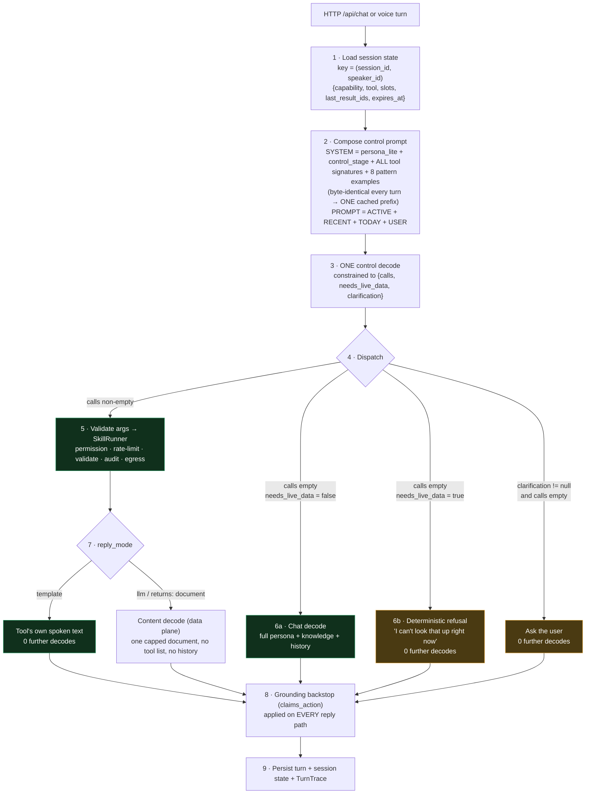
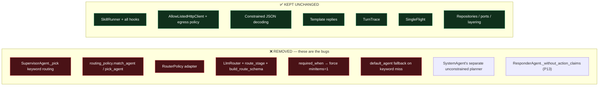
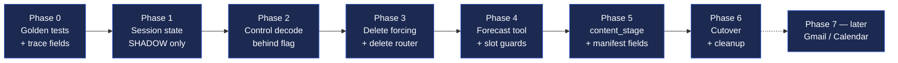
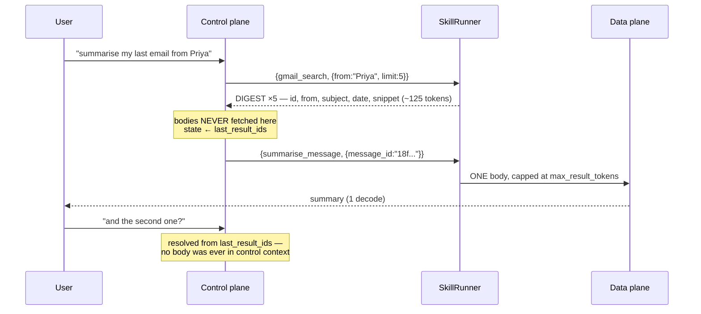

# 10 — Unified Assistant Orchestrator: context-aware routing design and implementation plan

**Status:** approved design, not yet implemented
**Supersedes the routing sections of:** `09-agent-architecture-redesign.md`
**Target device:** Raspberry Pi 5, 8 GB, CPU-only, Qwen3-4B Q4_K_M via llama.cpp

---

## Part 0 — Read this first (instructions for the implementing agent)

This document is the single source of truth for this change. It is written to be
implemented by an agent that has **not** taken part in the design discussion.

### 0.1 Rules you must follow

1. **Never invent a file path, class name, method signature or config key.**
   If this document does not state it, open the file and read it before writing.
2. **Verify before you edit.** Every file you touch must be read in full first.
3. **One phase at a time.** Phases are ordered. Do not start phase *N+1* until the
   "Done when" checklist of phase *N* passes.
4. **Do not refactor anything this document does not ask you to change.**
   No style changes, no renaming, no "while I'm here" improvements.
5. **If reality contradicts this document, stop and report it.** Do not
   improvise a fix. A contradiction means the design needs updating, not the code.
6. **Every behaviour change goes behind the feature flag** (§5.3) until phase 6.

### 0.2 Stop and ask the user if any of these are true

- A file named in this document does not exist, or its contents differ materially
  from what is described here.
- An open question in **Part 8** is still unanswered and blocks your phase.
- A phase's "Done when" checklist cannot pass and the cause is not an obvious bug
  in your own new code.
- You are about to delete code that is still referenced somewhere this document
  does not mention.

### 0.3 Verification status of the facts in this document

Facts below were confirmed by reading the repository. Anything marked
**ASSUMED** must be verified by you before you rely on it.

| Fact | Source | Status |
|---|---|---|
| `n_ctx: 4096`, `prompt_cache_mb: 768`, `~70 MB per cached prefix` | `config/inference.yaml` | verified |
| Measured warm/cold: chat 14 s → 2.4 s, routing 5.5 s → 2.4 s, tool decision 10 s → 4.2 s | `config/inference.yaml` comment | verified |
| `llm_routing: false` | `config/agents.yaml` | verified |
| `match_agent(message, candidates)` takes no history | `src/domain/policies/routing_policy.py` | verified |
| `required_when` forces a call with `minItems=1` | `src/service/agent/tool_turn_runner.py` | verified |
| `PromptComposer._static_cache` is keyed by `tuple(tool_names)` | `src/service/prompting/prompt_composer.py` | verified |
| `call_history_turns: int = 2` | `src/domain/policies/token_budget_policy.py` | verified |
| `MAX_CALLS = 3`, schema is a `oneOf` over tool names | `src/domain/policies/tool_call_schema.py` | verified |
| `narrate_stage` uses no tools and no history | `src/service/prompting/prompt_composer.py` | verified |
| `get_weather` is current-only; no forecast exists | `src/service/lookup/weather_lookup.py`, `config/tools/weather.yaml` | verified |
| `place` empty → `default_place` ("Hyderabad") | `src/service/lookup/place_resolver.py` | verified |
| `claims_action` is applied only on `ToolAgent`'s fallback branch | `src/service/agent/tool_agent.py` | verified |
| `ConversationManager.turns` is global across sessions | `src/service/conversation/conversation_manager.py` | verified |
| `ResponderAgent._render_history` has no per-turn clip and no token budget | `src/service/agent/responder.py` | verified |
| `bge-small-en-v1.5` embeddings already loaded; correct 0.53–0.72, incorrect 0.45–0.60 | `config/embedding.yaml` | verified |
| `ResponderAgent._without_action_claims` deletes tool exchanges from chat history, **and the user turn before them** | `src/service/agent/responder.py`, wired at `src/server.py:816` | verified |
| `SystemAgent` runs its **own** planner call with **no `json_schema`** (unconstrained), its own hardcoded 9-action catalogue in `_SYSTEM_PROMPT`, no history, and dispatches straight to `SystemControlPort` bypassing `SkillRunner` | `src/service/agent/system.py` | verified |
| No entry point supplies a session or speaker id; `current_session_id()` derives one from a **30-minute wall-clock gap** over the newest row in the whole table | `src/controller/routes/chat.py:23`, `stream.py:26`, `src/service/voice/voice_session.py:414`, `src/tpa/persistence/repositories/conversation_repository.py:49` | verified |
| RAG exists and is complete (`bge-small` → `SqliteVectorStore` → `SemanticRecall`), but indexes **summaries only**, and the summariser runs only after 10 min idle / 50 turns | `config/embedding.yaml`, `src/service/memory/semantic_recall.py`, `src/service/conversation/summariser.py` | verified |
| `src/service/skills/skill_runner.py` API | not read during design | **ASSUMED — read it** |
| `src/server.py` wiring order | not read during design | **ASSUMED — read it** |
| `src/domain/policies/grounding_policy.py::is_grounded` signature | referenced only | **ASSUMED — read it** |
| Existence of a per-request session or speaker id | unknown | **BLOCKING — see Part 8 Q1** |

---

## Part 1 — Background: what is broken and why

### 1.1 Vocabulary (plain English)

You need these terms to read the rest. Skip if you know them.

| Term | Meaning |
|---|---|
| **Prefill** | The model reading your prompt. Cost grows with prompt length. |
| **Decode** | The model writing output, one token at a time. Much slower per token than prefill. **Latency is dominated by the number of separate decodes.** |
| **KV cache** | Memory holding the model's internal state for tokens already processed. Allocated up front for the whole `n_ctx`. |
| **Prompt prefix cache** | llama.cpp remembering the KV state of a prompt *prefix* so an identical prefix is not re-processed. Only works if the prefix is **byte-identical** every time. This is why static text must come first and never vary. |
| **Constrained decoding** | Forcing the model's output to match a JSON schema (a grammar). An invalid tool name or argument becomes *physically impossible to emit*. Already used here. |
| **Tool manifest** | One YAML file per tool in `config/tools/`, declaring its name, arguments, examples, reply mode, permissions and allowed hosts. |
| **Slot** | One argument of a tool, e.g. `place` for `get_weather`. |
| **Session state** | Small structured memory of *what we are doing right now* — the active capability and its resolved slots. Different from conversation history and from saved facts. |
| **Control plane** | The step that decides *what to do*. Sees tool signatures, session state and short history. Never sees large content. |
| **Data plane** | The step that reasons *over content* (summarise an email, narrate a search result). Sees one document. Never sees the tool list. |
| **Grounding** | A reply may only assert facts that came from a tool result, the user's own message, or today's date. |
| **Fail-open** | On error, the system acts anyway — produces a wrong answer or a wrong action. Dangerous. |
| **Fail-closed** | On error, the system refuses or asks. Annoying but safe. |

### 1.2 Bug A — context is lost before the tool decision (false negative)

```
Turn 1  User: "What is the weather in Tokyo?"
        supervisor._pick → _pick_by_triggers → weather.yaml trigger matches "weather"
        → agent `lookup` → ToolTurnRunner → get_weather(place="Tokyo") → correct

Turn 2  User: "Should I bring an umbrella?"
        supervisor._pick → _pick_by_triggers
            weather trigger is \b(weather|temperature|forecast|humid|windy|rain|snow|how hot|cold|warm)\b
            "umbrella" and "tomorrow" appear in NO trigger  → no match
        → keyword overlap:
            message keywords after stopwords = {bring, umbrella}
            lookup description keywords      = {live, data, web, weather, currency, rates, news, ...}
            intersection = empty, best_score = 0 → match_agent returns None
        → llm_router is None because llm_routing: false
        → default_agent = "responder"
        → ResponderAgent CAN see Tokyo in history but has NO tool loop
        → ungrounded answer, and claims_action is not applied on this path
```

**Root cause:** `match_agent(message, candidates)` in
`src/domain/policies/routing_policy.py` receives only the newest message. The
routing decision is made *before* anything resolves the follow-up.

**Critically:** `PromptComposer.call_stage` *does* inject recent history into the
tool-decision prompt. If routing had reached `lookup`, the model would very
likely have filled `place=Tokyo`. **The capability already exists; routing never
gets there.**

### 1.3 Bug B — a regex forces a tool call the model correctly refused (false positive)

```
User: "I didn't ask about Singapore weather, what's 1+1?"

1. _pick_by_triggers: weather trigger matches the word "weather"  → agent `lookup`
2. ToolTurnRunner._decide: model reads the whole sentence, correctly returns {"calls": []}
3. guard.required_tools(message): weather.yaml required_when matches "weather"
4. `if not calls and required:` → FORCE
   retry with _FORCE_NOTE + build_call_schema(..., min_calls=1)
   the schema now makes {"calls": []} UNEMITTABLE
5. → get_weather(place="Singapore")  (or {} → default_place "Hyderabad")
6. → template reply: "In Singapore it's 31 degrees and humid."
```

**The user asked what 1+1 is and got the weather.** The model was right at step 2
and a regex overrode it at step 3.

### 1.4 Both bugs are the same disease

A regex reading the user's raw sentence cannot tell a **mention** from a
**request**. It has no notion of negation, quotation, hypotheticals or discourse.

| Message | regex sees | reality |
|---|---|---|
| "Should I bring an umbrella?" | nothing | **is** a weather request → false negative |
| "I didn't ask about Singapore weather, what's 1+1?" | weather | **is not** a weather request → false positive |
| "What does the word *forecast* mean?" | forecast | meta-question |
| "Don't tell me the weather, just the time" | weather | explicit refusal |
| "My app shows the temperature wrong, how do I debug it?" | temperature | technical question |

This failure class is **unbounded**. You cannot enumerate it in YAML. Any fix
that keeps a regex deciding actions will fail again on a phrasing nobody thought of.

---

## Part 2 — Design principles

Apply these when this document does not cover a case. They are ordered; earlier
principles win.

### P1 — A regex may constrain the model's **output**. It may never read the user's **input** to decide an action.

| Regex applied to | Decides | Sound? | Why |
|---|---|---|---|
| user's raw message → pick a tool | action | ❌ | requires semantics it does not have |
| user's raw message → force a call | action | ❌ | Bug B |
| user's raw message → skip the model | action | ❌ | Bug A |
| **model's emitted argument** → normalise (`"here"` → home city) | interpretation | ✅ | the model *chose* that value after reading the sentence |
| **model's emitted reply** → refuse an unbacked claim | veto | ✅ | fails closed |
| tool output → truncate to a token cap | mechanical | ✅ | no semantics involved |

### P2 — One decision, one component, one decode.

Dispatch ("which capability?") and slot-filling ("`place=Tokyo`") are the **same
decision**. Splitting them across two components is what destroys the
information. Never add a second decision-maker.

### P3 — Prefer structural invariants over vocabulary lists.

Vocabulary is unbounded and needs a dataset you cannot build. Structure is closed
and needs none.

| Vocabulary rule (does not scale) | Structural invariant (scales) |
|---|---|
| "these words mean weather" | the model emits the tool name under a grammar |
| "these phrases are claims" | `needs_live_data` + numbers must appear in sources |
| "these words mean the user is asking" | "did a tool run?" is a fact in the execution record |
| "these words are email-ish" | `returns: digest` structurally bars bodies from the control prompt |

### P4 — Fail closed.

When uncertain: clarify, or say "I can't look that up". Never guess a live fact,
never guess a destructive target.

### P5 — Static prompt tokens are nearly free; volatile tokens and extra decodes are not.

A cached prefix is paid once. An evicted prefix costs 6–10 s (measured). Optimise
the volatile tail and the decode count, not the static block.

### P6 — Accuracy comes from information, not model size.

"umbrella" is unanswerable alone and trivial with `ACTIVE: weather, place=Tokyo`.
On a 4 B Q4 model, feeding the decision better context is the only lever you have.

---

## Part 3 — Target architecture

### 3.1 The pipeline



### 3.2 What is deleted



### 3.3 Decode count per turn — the latency contract

| Turn | Today | After |
|---|---|---|
| Tool turn with template reply (weather, currency, tasks, remember) | 1 | **1** |
| Follow-up ("umbrella?") | 1 — **wrong answer** | **1** — correct |
| Tool turn needing narration (web search) | 2 | **2** |
| Summarise an email | n/a | **2** |
| Clarification needed | n/a | **1** |
| `needs_live_data` refusal | n/a | **1** |
| **Pure chat** | **1** | **2** ⚠️ accepted regression, §6.2 |
| Multi-intent ("weather Tokyo **and** convert 100 USD") | impossible | **1** |

Maximum decodes per turn: **2**. Same as today's maximum.

### 3.4 Target components

The agent count drops from **six to two**, because `lookup`, `tasks` and `memory`
were never capabilities — they were *menus*, created so the router had something
to choose between. Remove the router and the menus have no purpose. The tools
they owned survive untouched as manifests.

| Today | Target | Note |
|---|---|---|
| `SupervisorAgent` | ❌ deleted | no routing decision exists |
| `ToolAgent` (`lookup`) | ❌ deleted | tools kept as manifests |
| `ToolAgent` (`tasks`) | ❌ deleted | tools kept as manifests |
| `ToolAgent` (`memory`) | ❌ deleted | tools kept as manifests |
| `SystemAgent` | ❌ deleted | → becomes tool manifests, §4.5.1 |
| `ResponderAgent` | ✅ **kept** | role unchanged: chat only |
| — | ✅ **`AssistantOrchestrator`** | new |

| Agent | Runs when | Sees | LLM calls |
|---|---|---|---|
| `AssistantOrchestrator` | **every turn** | all tool signatures, session state, 2 exchanges, the message | 1 control + at most 1 content |
| `ResponderAgent` | only `calls: []` **and** `needs_live_data: false` | persona, saved facts, summaries, semantic recall, history — **no tools** | 1 chat |

There are three decision surfaces in the current code, not two: the regex router,
`ToolTurnRunner.decide`, and `SystemAgent`'s own planner. The target has **one**.

Not agents and unchanged: `SkillRunner`, the skills, `LookupService`,
`PlaceResolver`, `AllowListedHttpClient`, `PromptComposer`, `ConversationManager`,
`SemanticRecall`, the repositories, and `ToolUseGuard` (reply-veto role only).

---

## Part 4 — Exact specifications

Everything in this part is a contract. Implement it literally.

### 4.1 The control decode output schema

Build this in `src/domain/policies/tool_call_schema.py` as a new function
`build_control_schema(manifests, *, max_calls=MAX_CALLS)`.

```json
{
  "calls": [
    { "tool": "get_weather_forecast", "args": { "place": "Tokyo", "date_offset": 1 } }
  ],
  "needs_live_data": true,
  "clarification": null
}
```

JSON Schema shape:

| Field | Type | Constraint |
|---|---|---|
| `calls` | array | `items` = existing `oneOf` over all visible manifests; `minItems: 0`, `maxItems: 3` |
| `needs_live_data` | boolean | required |
| `clarification` | string or null | required; `maxLength: 200` |

- Reuse the existing `tool_args_schema()` and `oneOf` construction. Do not rewrite them.
- Keep `build_call_schema` in place during phases 1–5 so the old path still runs
  behind the flag. Delete it in phase 6.
- **Never** build this schema with `minItems: 1`. Forcing is deleted (§4.6).

#### Dispatch table — implement exactly this, in this order

| Condition | Action |
|---|---|
| `calls` non-empty | Execute the calls. Ignore `clarification`. |
| `calls` empty **and** `clarification` is a non-empty string | Reply with the clarification text. No further decode. |
| `calls` empty **and** `needs_live_data == false` | Hand to the chat path (`ResponderAgent`). |
| `calls` empty **and** `needs_live_data == true` | Deterministic refusal template. **Never** hand to free chat. |

Refusal template (configurable string, not generated):

```
I can't look that up right now.
```

### 4.2 Definition of `needs_live_data` — put this text in the prompt verbatim

The whole design hangs on this field being well defined. The prompt must say:

```
needs_live_data = true ONLY if answering requires information that changes over
time, or that is private to this user:
  weather · prices · exchange rates · news · scores · my tasks ·
  my saved facts · my email · my calendar

needs_live_data = false for everything else:
  maths · definitions · general knowledge · explanations · code ·
  opinions · translation · small talk · anything about this conversation
```

Worked expectations (these become golden tests):

| Message | `calls` | `needs_live_data` | Result |
|---|---|---|---|
| "What's 1+1?" | `[]` | false | chat → "2" |
| "How many degrees in a right angle?" | `[]` | false | chat → "90 degrees" |
| "What's the capital of Japan?" | `[]` | false | chat → "Tokyo" |
| "I didn't ask about Singapore weather, what's 1+1?" | `[]` | false | chat → "2" |
| "What's the weather in Tokyo?" | `[get_weather]` | true | tool |
| "Should I bring an umbrella?" *(after Tokyo)* | `[get_weather_forecast, place=Tokyo]` | true | tool |
| "Will it rain tomorrow?" *(before the forecast tool exists)* | `[]` | true | refusal, **not** a hallucination |

### 4.3 Session state

**New table.** Follow the existing repository/port pattern — read an existing
port under `src/domain/ports/` and an existing SQLite adapter under `src/tpa/`
before writing this.

```
session_context
---------------
session_id       TEXT    NOT NULL
speaker_id       TEXT    NOT NULL   -- "" when speaker identity is unavailable
capability       TEXT    NOT NULL   -- e.g. "weather", "tasks", "mail"
tool             TEXT    NOT NULL   -- last successful tool name
slots            TEXT    NOT NULL   -- JSON object of validated args
last_result_ids  TEXT    NOT NULL   -- JSON array, for "the second one" follow-ups
pending          TEXT    NOT NULL   -- JSON object or "{}" -- see 4.3.1
updated_at       TIMESTAMP NOT NULL
expires_at       TIMESTAMP NOT NULL
PRIMARY KEY (session_id, speaker_id)
```

Exactly **one row per (session_id, speaker_id)**. Upsert, never append.

| Rule | Detail |
|---|---|
| **Write when** | After a call returns `ok == True`. Never on failure, never on a refusal. |
| **Write what** | The *validated* args that were actually sent to the skill — not what the model emitted. |
| **TTL** | `expires_at = updated_at + session_ttl_sec` (new config key, default **900** = 15 min). |
| **Read** | Rows with `expires_at <= now` are treated as absent. Delete lazily. |
| **Never write** | For tools where `destructive: true` (§4.5). |
| **Scope** | Per `(session_id, speaker_id)`. **Never process-wide.** See Part 8 Q1. |

#### 4.3.0 Resolving the session id — do this exactly once per turn

No entry point supplies a session id. `ConversationRepository.current_session_id()`
derives one by reading the newest row in the **whole** table and reusing its
`session_id` if the gap is under 30 minutes, otherwise minting `uuid4().hex[:8]`.

That is correct for a single-user device, but it is **recomputed at every call
site**. If the orchestrator resolves it once to read state and again to write
state, a 30-minute boundary crossing between the two produces **different ids** —
so the write lands on a different row than the read. Rare, silent, and wrong.

| Rule | Detail |
|---|---|
| **Resolve once** | At turn start: `session_id = ctx.session_id or conversation_repo.current_session_id()`. Pass it down. **Never call `current_session_id()` twice in a turn.** |
| **Add the fields now** | `AgentContext` gains `session_id: str \| None = None` and `speaker_id: str = ""`. Additive, no behaviour change, no migration later. |
| **Thread the entry points** | `ChatRequest` gains an optional `session_id`; pass it through `chat.py`, `stream.py` and `voice_session.py`. All three currently construct `AgentContext` without one. |
| **`speaker_id`** | `""` until speaker profiles ship. The column exists from day one so the primary key never changes. |

#### 4.3.1 Pending clarification

There is **no paused execution** anywhere in this design. Every turn is a
complete, independent pass through the pipeline. A clarification is resolved
because turn *N+1* **reads a row turn *N* wrote** — not because anything resumed.
That is what makes it survive a restart and a switch between voice and HTTP.

```json
{
  "tool": "tasks",
  "partial_args": {"action": "delete"},
  "awaiting": "title",
  "candidates": ["buy milk", "call the bank", "renew passport"],
  "attempts": 1
}
```

Rendered into the **volatile** tail as one line (~25 tokens), only when non-empty:

```
PENDING: tasks.delete · awaiting: title · candidates: buy milk | call the bank | renew passport
```

| Event | `pending` |
|---|---|
| The turn produces any tool call | **cleared** |
| The turn is ordinary chat (topic changed) | **cleared** |
| Another clarification is emitted | **replaced**, `attempts += 1` |
| TTL expires | treated as absent |
| `attempts` would exceed **2** | reply once plainly and **clear** — never loop a voice user |

> **Validate before committing:** the clarification question is one turn old and
> `control_history_exchanges: 2` keeps it in `RECENT:`, so the model *may* resolve
> it from prose alone. Measure in Phase 2. If prose suffices, `pending` can be
> deferred — but prose fragility is exactly what caused P13, so the structured
> form is preferred.

### 4.4 The control prompt layout

Create `config/prompts/control_stage.md`. Model it on the existing
`config/prompts/call_stage.md`.

```
SYSTEM  ← static, byte-identical every turn, ONE cached prefix
────────────────────────────────────────────────────────────
  {persona_lite}

  {control_stage.md body, with placeholders substituted:}
    <<tools>>     = one signature line for EVERY registered tool
    <<patterns>>  = the 8 fixed pattern examples below
    (the needs_live_data definition from §4.2, verbatim)

PROMPT  ← volatile, changes every turn
────────────────────────────────────────────────────────────
  ACTIVE: weather | place=Tokyo | 3 min ago        ← omit entirely if none or expired
  RECENT:
  User: ...
  Veda: ...
  TODAY: Monday 06 Oct 2026, 14:30.
  USER: Should I bring an umbrella?
```

Hard requirements:

1. The SYSTEM block **must not** contain the date, history, state or the user
   message. Any variation destroys the prefix cache and costs 6–10 s.
2. `_static_cache` must now be keyed by **one global key**, not by
   `tuple(tool_names)`. There is exactly one control tool set.
3. `ACTIVE:` is at most ~25 tokens and is **omitted entirely** when state is
   absent, expired, or belongs to a destructive capability.

#### The 8 fixed pattern examples — replace per-tool examples with these

Per-tool examples grow the prompt as **O(number of tools)** and are what breaks
`n_ctx` first. These patterns are **O(1)** and stay constant forever.

| # | Pattern | Example |
|---|---|---|
| 1 | named entity extraction | `"weather in Mumbai"` → `{place:"Mumbai"}` |
| 2 | empty argument / default | `"is it raining"` → `{}` |
| 3 | follow-up slot reuse | `ACTIVE: place=Tokyo` + `"and tomorrow?"` → `{place:"Tokyo", date_offset:1}` |
| 4 | **mention without request** | `"I didn't ask about Singapore weather, what's 1+1?"` → `calls: []`, `needs_live_data: false` |
| 5 | no tool, general knowledge | `"explain recursion"` → `calls: []`, `needs_live_data: false` |
| 6 | live data with no tool available | → `calls: []`, `needs_live_data: true` |
| 7 | multi-intent | two calls in one array |
| 8 | ambiguous → clarify | `"delete it"` with several candidates → `clarification: "Which task do you mean?"` |

Pattern 4 is the Bug B regression guard and is **mandatory**.

Keep `examples:` in each manifest — they remain valuable for golden tests and
documentation — but **stop rendering all of them into the prompt**. A manifest may
opt in to **at most one** canonical example via a new `prompt_example: true` flag
on a single example, subject to a global budget cap.

### 4.5 Tool manifest changes

Add to `src/domain/entities/tool_manifest.py` and to the YAML loader:

| Field | Type | Default | Meaning |
|---|---|---|---|
| `returns` | `"digest" \| "value" \| "document"` | `"value"` | `digest`/`value` may enter the control prompt. **`document` may never.** It goes only to the data plane. |
| `max_result_tokens` | int | from budgets | Hard cap applied to the tool result **before** it reaches any prompt. |
| `destructive` | bool | `false` | Whole-tool shorthand. Never inherit session slots; never write session state; always require explicit target + approval. |
| `destructive_when` | map of param → values | `{}` | Per-argument granularity, for tools whose `action` enum mixes safe and destructive operations. |

A call is destructive if `manifest.destructive` is true **or** any
`destructive_when[param]` list contains the value the model emitted for that param.
A per-tool boolean alone is too coarse: `tasks` and `remember` each expose both
safe and destructive actions, and marking the whole tool destructive would stop
`tasks add` inheriting context for no reason.

| Tool | Setting |
|---|---|
| `tasks` | `destructive_when: {action: [delete]}` |
| `remember` | `destructive_when: {action: [forget]}` |
| `app_control` | `destructive_when: {action: [close]}` |
| terminal, file-ops, future `send_email` / calendar delete | `destructive: true` |
| weather, forecast, currency, search, `volume_control`, `device_status` | neither — read-only or trivially reversible |

Field repurposing:

| Field | Before | After |
|---|---|---|
| `triggers` | **decided** the agent | Unused at runtime in Plan A. Keep the field — Plan B (§6.3) uses it for grouping. |
| `required_when` | **forced** a call | **No longer forces anything.** Keep the field for golden tests only. |
| `claims` | checked on one branch | Checked on **every** reply path, as a backstop only (§4.7) |

#### 4.5.1 Converting `SystemAgent` into tool manifests

`SystemAgent` is a **third decision point**: it makes its own `client.complete()`
call with **no `json_schema`** (so malformed JSON is possible — hence its
`_JSON_FENCE_RE` and hand-rolled `_parse`), carries a hardcoded 9-action
catalogue in `_SYSTEM_PROMPT`, receives **no history**, burns its own cached
prefix, and dispatches straight to `SystemControlPort` bypassing `SkillRunner`.

Its actions become manifests. Use **three**, grouped by argument shape — one
eight-way enum with three unrelated optional args gives the 4 B model a harder
job than three clean schemas:

| Manifest | Params | Replaces |
|---|---|---|
| `app_control` | `action: [open, close, focus]`, `name: string` | `open_app`, `close_app`, `focus_app` |
| `volume_control` | `action: [get, set, mute, unmute]`, `level?: integer` | `get_volume`, `set_volume`, `mute` |
| `device_status` | `what: [battery, processes]` | `battery_info`, `top_processes` |

`{"action": "none"}` is dropped — it is `{"calls": []}` reinvented.

| | Today | After |
|---|---|---|
| Output validity | unconstrained | **grammar-constrained** |
| Context | none | session state + history — *"turn it up"* works |
| Execution | direct to `SystemControlPort` | through **`SkillRunner`** (permission, rate limit, validation, audit) |
| Cached prefixes | +1 (~70 MB) | **0** — folded into the control prefix |
| Prompt cost | — | 3 signature lines ≈ 60 tokens |

Requires a thin skill wrapper around `SystemControlPort` so `SkillRunner` can
invoke it. Give `app_control` with `action: close` a higher `permission_level` —
closing an app can lose unsaved work.

### 4.6 Slot resolution rules

> **Code never infers a slot from the user's raw message.** (P1)

| Step | Who | Rule |
|---|---|---|
| 1 | Prompt | Put `ACTIVE: capability \| slot=value \| age` in the volatile tail when state is fresh and non-destructive. |
| 2 | **Model** | Decides whether to reuse, replace or omit the slot. It has read the whole sentence; code has not. |
| 3 | Code | Normalises the **model's emitted argument** only. `PlaceResolver._HERE_WORDS` mapping `"here"`/`""` → `default_place` stays exactly as it is. |
| 4 | Code | If `destructive: true`, ignore session state completely and require an explicit target. |
| 5 | Code | Write the *validated* args back to session state on success. |

**Do not** write a rule like "if the message has no place word, use the state
place". That is a regex reading user input and it is forbidden by P1.

**Visibility requirement:** template replies must always name the resolved slot
("In **Tokyo** tomorrow…") so a wrong inheritance is visible to the user in one turn.

### 4.7 Reply policy

| Tool class | Reply | Extra decodes |
|---|---|---|
| `reply_mode: template` (weather, currency, tasks, remember) | the tool's own `spoken` text | **0** |
| `returns: document` (search, summarise, draft) | data-plane content decode | 1 |
| `calls: []`, `needs_live_data: false` | chat path with full persona | 1 |
| `calls: []`, `needs_live_data: true` | deterministic refusal string | **0** |
| `clarification` set | the clarification string | **0** |
| Any tool failed | deterministic failure text. **Never** invent a result. | 0 |

**Backstop (not the primary gate):** apply `ToolUseGuard.claims_action` to the
final reply on **every** path. If it fires and no tool executed successfully,
replace the reply with the existing `_UNCONFIRMED_REPLY` and record a trace note.
`needs_live_data` is the primary gate; this only catches what it misses.

**Removed:** `ResponderAgent._without_action_claims`. It deletes successful tool
exchanges — *and the user turn before them* — from chat history, which is why
"umbrella" sees no Tokyo at all (P13). The fabrication it guarded against is now
blocked earlier by `needs_live_data`, before generation, without taking real
context with it. `claims_action` keeps only its outgoing-reply veto role.

#### 4.7.1 Multi-call reply rules

All calls are emitted in **one** decode, so **call 2 cannot use call 1's output**.
Independent intents work in a single turn; dependent chains (`gmail_search` →
`summarise_message(id)`) take two turns. This is deliberate — it keeps decodes
bounded at 2.

| Calls in a turn | Reply production | Content decodes |
|---|---|---|
| all `reply_mode: template` | join each tool's `spoken` text in call order | **0** |
| all `returns: document` | **one** `content_stage` over all results | **1** |
| mixed | see rule below | **1** |
| any call failed | deterministic failure text for that call, joined with the rest | 0 |

> **Rule — a `template` result is never sent to the model.** Only
> `returns: document` results reach `content_stage`; template sentences are kept
> verbatim and joined in call order.
>
> Today's `_reply` hands *all* results to the narrate stage if *any* call needs
> narration, re-exposing verified provider numbers to the model. `is_grounded`
> catches fabricated digits, but "never passed through the model" is a stronger
> guarantee and costs fewer content-stage tokens.

The number of content decodes **does not scale with the number of calls**. A
three-call turn still costs at most 2 decodes total.

Destructive tools are excluded from multi-call.

### 4.8 Data plane — generalise `narrate_stage`

`narrate_stage` is already the correct shape: *no tools, no history, one capped
result*. Generalise it:

```
narrate_stage(user_message, tool_results)
  →  content_stage(task, document, user_message)

task ∈ { "narrate", "summarise", "draft_reply", "extract" }
```

Rules:

1. Keep `narrate` behaviourally identical. Its existing grounding check
   (`is_grounded`) must still run for that task.
2. The task instruction line goes in the **volatile** tail, not the system block,
   so all tasks share **one** cached prefix.
3. `document` is capped at the tool's `max_result_tokens` **before** composition.
4. The content stage never receives the tool list and never receives history.
5. A content decode must **never** trigger egress or a state change.

### 4.9 Memory tiers and RAG policy

Veda already has a complete RAG stack — `bge-small-en-v1.5` → `MemoryIndexer` →
`SqliteVectorStore` → `SemanticRecall` → the `RELEVANT THINGS I REMEMBER:` block
in `ResponderAgent`. It indexes `sources: [summary]` only.

**RAG is not, and never was, the fix for the follow-up bug.** The
`ConversationSummariser` runs only after **10 minutes idle or 50 turns**, so when
"should I bring an umbrella?" arrives seconds later the Tokyo turn is still a raw
unsummarised row and **is not in the vector store at all**. Retrieval could not
have found it.

The gap was a missing *horizon*, not missing retrieval:

| Tier | Horizon | Form | Answers | Used by |
|---|---|---|---|---|
| **Session state** (new) | seconds → 15 min | **structured** | "what are we doing right now?" | **control decode** |
| Raw turns | current session (30-min gap) | prose | "what was just said?" | control (2 exchanges) + chat |
| Summaries | past sessions | compressed prose | "what happened before?" | chat |
| RAG / vector | all time | semantic | "what's relevant from long ago?" | chat |
| Saved facts | permanent | key–value | "what did I ask you to remember?" | chat |

Policy:

| Decision | Verdict | Reason |
|---|---|---|
| Keep RAG on the chat path | ✅ **yes**, unchanged | genuinely useful for older topics |
| Inject RAG into the **control decode** | ❌ **no** | measured bands overlap (correct 0.53–0.72, incorrect 0.45–0.60) — injected noise into a decision prompt, plus ~450 tokens of mostly irrelevant prose. This is exactly the selection-accuracy risk §6.1 row 1 is trying to bound. |
| Index raw turns as well | ❌ not now | session state covers that horizon far more cheaply and exactly |
| Change the summariser, indexer or embedding model | ❌ **no** | out of scope for this migration |

---

## Part 5 — Implementation plan

### 5.1 Phase order



### 5.2 Non-negotiable: Phase 0 first

No behaviour may change before the golden set exists and passes against the
**current** code. Without a baseline you cannot tell a fix from a regression.

### 5.3 The feature flag

Add to `config/agents.yaml`:

```yaml
# Unified control decode: one context-aware tool decision replaces keyword routing.
# false = legacy supervisor + ToolTurnRunner path (rollback target).
orchestrator_enabled: false

# Session state time-to-live in seconds. State older than this is ignored.
session_ttl_sec: 900

# Recent complete exchanges included in the control prompt.
control_history_exchanges: 2
```

Both code paths must coexist until phase 6. Rollback = set the flag to `false`.

---

### Phase 0 — Baseline and observability

**Goal:** measurable ground truth. No behaviour change whatsoever.

| Do | Where |
|---|---|
| Add the golden test set (Part 7) as a test module | `tests/eval/` — read the existing contents of `tests/eval/` first and follow its conventions |
| Record the current pass/fail of every case against today's code | commit the baseline |
| Add fields to `TurnTrace`: `state_used`, `slots_inherited`, `needs_live_data`, `clarified`, `fast_path`, `prefix_cache_hit` | `src/domain/entities/turn_trace.py` + its repository |
| Capture 3 real Pi traces with `prompt_tokens` and `timings_ms` | manual |

**Done when**
- [ ] Every golden case runs and its current result is recorded (many will fail — that is the point).
- [ ] New trace fields appear in stored traces, defaulting to `null`/`false`.
- [ ] No existing test regressed.

**Rollback:** revert the commit. Nothing in the request path changed.

---

### Phase 1 — Session state, shadow mode only

**Goal:** build and populate session state. **Do not let it affect any reply.**

| Do | Where |
|---|---|
| Add `session_id: str \| None = None` and `speaker_id: str = ""` to `AgentContext` | `src/domain/entities/agent_context.py` |
| Add optional `session_id` to `ChatRequest`; thread it through all three entry points | `src/schemas/chat.py`, `src/controller/routes/chat.py`, `stream.py`, `src/service/voice/voice_session.py` |
| Add `SessionContextPort` | `src/domain/ports/` — mirror an existing port file |
| Add the SQLite adapter and table from §4.3 (include `pending`, unused until Phase 2) | `src/tpa/` — mirror an existing adapter |
| Wire it in `bootstrap()` | `src/server.py` |
| Resolve the session id **once per turn** (§4.3.0) and pass it down | turn entry point |
| Write state after successful calls | `src/service/agent/tool_agent.py::_persist` |
| Compute the `ACTIVE:` line and **log it only** | `src/service/prompting/prompt_composer.py` |

**Done when**
- [ ] After "weather in Tokyo", the table holds `capability=weather`, `slots={"place":"Tokyo"}`, a future `expires_at`.
- [ ] Logs show the proposed `ACTIVE:` line on the next turn.
- [ ] **No prompt, reply or route changed.** Golden results are byte-identical to the Phase 0 baseline.
- [ ] Rows are scoped by `(session_id, speaker_id)`.

**Rollback:** stop calling the writer. The table is inert.

---

### Phase 2 — The control decode, behind the flag

**Goal:** one context-aware decision, selectable by flag.

| Do | Where |
|---|---|
| Add `build_control_schema` (§4.1) | `src/domain/policies/tool_call_schema.py` |
| Add `config/prompts/control_stage.md` incl. the §4.2 text verbatim | `config/prompts/` |
| Add `control_stage()`; key `_static_cache` by ONE global key; inject `ACTIVE:`; use complete **exchanges** not raw turns | `src/service/prompting/prompt_composer.py` |
| Add `AssistantOrchestrator` implementing the §3.1 pipeline and the §4.1 dispatch table | `src/service/agent/` (new file) |
| When the flag is on, `SupervisorAgent.execute` delegates straight to the orchestrator | `src/service/agent/supervisor.py` |

Constraints:
- Reuse `SkillRunner`, `ToolAgent`'s execution and trace code, and the existing
  `_execute` / `ExecutedCall` structures. **Do not reimplement execution.**
- Do not delete anything in this phase.

**Done when**
- [ ] Flag off → behaviour identical to Phase 1.
- [ ] Flag on → "weather in Tokyo" then "should I bring an umbrella?" reuses Tokyo.
- [ ] Flag on → "I didn't ask about Singapore weather, what's 1+1?" answers "2".
- [ ] Flag on → exactly **one** control decode per turn, confirmed in `timings_ms`.
- [ ] `prompt_tokens["control"]` is stable turn to turn (prefix is byte-identical).

**Rollback:** `orchestrator_enabled: false`.

---

### Phase 3 — Remove the forcing regex and the router

**Goal:** delete the two mechanisms that cause Bugs A and B.

| Do | Where |
|---|---|
| Delete the `required_when` force branch (the `if not calls and required:` block and `_FORCE_NOTE`) | `src/service/agent/tool_turn_runner.py` |
| Apply `claims_action` to every reply path as a backstop (§4.7) | orchestrator + chat path |
| Delete keyword routing: `match_agent`, `pick_agent`, `_pick_by_triggers`, `_keywords`, `_STOPWORDS`, `_MIN_SCORE` | `src/domain/policies/routing_policy.py` |
| Delete `RouterPolicy` | `src/service/agent/router_policy.py` |
| Delete `LlmRouter`, `route_stage`, `build_route_schema`, `llm_routing` | `llm_router.py`, `prompt_composer.py`, `tool_call_schema.py`, `config/agents.yaml`, `config/prompts/router.md` |
| Delete `_without_action_claims` and the `claim_filter` wiring (P13) | `src/service/agent/responder.py`, `src/server.py:816` |
| Convert `SystemAgent` to the three manifests in §4.5.1; add a `SystemControlPort` skill wrapper; delete the agent and `_SYSTEM_PROMPT` | `src/service/agent/system.py`, `config/tools/`, `src/service/skills/` |
| Update or delete `tests/test_llm_routing.py`, `tests/test_golden_routing.py`, `tests/test_slow_device.py` | `tests/` |

**Do this phase only with the flag ON and Phase 2 green.** If you need rollback
after this point, it is a git revert, not a flag.

**Done when**
- [ ] No regex anywhere reads `ctx.user_message` to choose or force an action.
  Grep for `required_tools`, `match_agent`, `triggers` in `src/service/` and
  `src/domain/policies/` and confirm every remaining hit is output-side or unused.
- [ ] Golden "mention without request" cases all pass.
- [ ] Tool-dependent golden cases (tasks, remember, weather) still pass — the
  forcing removal did not regress them.

---

### Phase 4 — Forecast tool and slot guards

**Goal:** stop answering about tomorrow with today's data.

| Do | Where |
|---|---|
| Add `get_weather_forecast(place, date_offset: 0..6)` — Open-Meteo `daily=` fields, same hosts, same cache | `src/service/lookup/weather_lookup.py` |
| Add `config/tools/weather_forecast.yaml` | `config/tools/` |
| Ensure template replies name the resolved place and the day | weather skill |
| Add `destructive: true` where listed in §4.5 | `config/tools/*.yaml` |
| Bound `ResponderAgent._render_history`: clip per turn and apply a token budget, mirroring `PromptComposer` | `src/service/agent/responder.py` |
| Scope `ConversationManager.turns` by session/speaker | `src/service/conversation/conversation_manager.py` |

**Done when**
- [ ] "weather in Tokyo" → "will it rain tomorrow?" → forecast tool, `place=Tokyo`, `date_offset=1`.
- [ ] Reply names both place and day.
- [ ] A destructive tool never inherits a slot from session state.
- [ ] Responder prompt token count is bounded and logged.
- [ ] `app_control`, `volume_control`, `device_status` behave as `SystemAgent` did, now through `SkillRunner`.

> **Why `date_offset: 0..6` and not an ISO date.** Asking a 4 B Q4 model to
> compute `"2026-10-08"` from `TODAY:` is error-prone; `tomorrow → 1` is not.
> Code does the date arithmetic and rejects out-of-range values. Relative-date
> resolution is a known weak spot for small models — do not move it into the model.

---

### Phase 5 — Data plane

| Do | Where |
|---|---|
| `narrate_stage` → `content_stage(task, document, user_message)`; task line in the **volatile** tail | `src/service/prompting/prompt_composer.py` |
| Add `returns`, `max_result_tokens`, `destructive` to the manifest entity and loader | `src/domain/entities/tool_manifest.py`, YAML adapter |
| Enforce: a result with `returns: document` **never** enters the control prompt | orchestrator |
| Enforce `max_result_tokens` before composition | orchestrator |

**Done when**
- [ ] `narrate` behaviour and its grounding check are unchanged.
- [ ] A `document` result cannot reach the control prompt (add a test that asserts this).
- [ ] Only one cached prefix exists for all content tasks.

---

### Phase 6 — Cutover and cleanup

| Do |
|---|
| Flip `orchestrator_enabled: true` by default |
| Delete `build_call_schema`, `call_stage`, `_FORCE_NOTE` and the legacy `ToolTurnRunner` decide path |
| Collapse `ToolAgent` into the orchestrator if nothing else uses it |
| Confirm exactly **3** cached prefixes exist: control, content, chat persona |

**Done when**
- [ ] All golden cases pass on the real Pi.
- [ ] Accuracy targets in Part 6 are met.
- [ ] p50 and p95 turn latency are within budget for HTTP and voice.
- [ ] Prefix count and `prompt_cache_mb` usage are measured and recorded.

---

### Phase 7 — Gmail and Calendar (later, do not start early)

The two-plane rule is what makes this safe:



Rules:
- `gmail_search` → `returns: digest`. `summarise_message` → `returns: document`.
- Control and data planes exchange **references (ids), never content**.
- "Send email" is `destructive: true`, requires approval, and is a control-plane
  call. A data-plane decode must never trigger egress.

---

## Part 6 — Failure modes, accepted risks, accuracy targets

### 6.1 New problems this design introduces

| # | Problem | Why | Mitigation | Residual |
|---|---|---|---|---|
| 1 | Selection accuracy across 15–30 tools | 4 B Q4 on a longer list | schema constraint; pattern examples; measure | **Medium — main risk** |
| 2 | False tool calls on chat turns | every turn now sees all tools | pattern examples 4 and 5; measure | Medium |
| 3 | Stale state inherited | TTL is a guess | short TTL; **reply names the slot** | Low |
| 4 | Cross-speaker state leak | if no session id exists | **blocked on Part 8 Q1** | Low once resolved |
| 5 | Slower first turn after boot | one larger prefix | extend existing `warmup_on_boot` to prewarm the control prefix | Negligible |
| 6 | Multi-intent widens blast radius | `maxItems: 3` | destructive tools excluded from multi-call | Low |
| 7 | Regression in paths that work today | prompt shape changes | Phase 0 baseline | Medium if Phase 0 skipped |
| 8 | Model mis-sets `needs_live_data` | semantic judgement | fail-closed when wrongly `true`; `claims_action` backstop when wrongly `false` | Medium |
| 9 | Qualitative hallucination with no numbers | `is_grounded` is number-shaped | `needs_live_data` catches most | Low, not zero |

### 6.2 Accepted regression — chat turns cost 2 decodes

Control decode (`{"calls": []}`, ~8 output tokens, always-warm prefix) **plus** the
chat decode. Measure it on the Pi. If unacceptable, the levers are, in order:

| Option | Chat decodes | Cost |
|---|---|---|
| **1 — accept** (recommended) | 2 | ~+1 s on chat turns |
| 2 — merged schema `{"calls":[], "reply":"…"}` | 1 | loses persona, saved facts, semantic recall, **and token streaming** |
| 3 — model-chosen handoff flag | 1 or 2 | model judges whether it needs the rich prompt; unreliable |

**Do not implement option 2 or 3 without asking the user first.**

### 6.3 Plan B if risk 1 materialises

If measured incorrect-tool rate exceeds target, narrow with **fixed, pre-declared
tool groups** (e.g. `core`, `core+mail`, `core+workspace`) selected deterministically.
That keeps **one decode** and caps prefixes at 3–4. You lose cross-group multi-intent.

**Plan B is never a second decode, never a second model, never a regex over user input.**

### 6.4 Accuracy targets by harm class

| Class | Example | Harm | Target | Structural backstop |
|---|---|---|---|---|
| Wrong chat answer | over-helpful reply | low | best effort | user retries |
| Unnecessary tool call | fires weather on a meta-question | low | **< 3 %** | reply names the slot |
| **Missed tool call** | umbrella → ungrounded chat | **high — the original bug** | **< 2 %** | `needs_live_data` blocks free chat |
| Wrong slot | Tokyo → Hyderabad | medium | **< 2 %** | slot named in reply |
| Unnecessary refusal | "capital of Japan" → "I can't" | low | **< 2 %** | fail-closed |
| **Wrong write** | task created, email sent, file deleted | **severe** | **≈ 0** | approval hook + no state inheritance |

### 6.5 Why no LLM router, of any size

Recorded so this is not re-litigated.

| Option | Decodes | Latency | RAM | Fixes Bug A | Fixes Bug B |
|---|---|---|---|---|---|
| Regex router (today) | 0 | 0 | 0 | ❌ | ❌ |
| 4 B LLM router | +1 | **+2.4 s warm (measured)** | +70 MB prefix | ✅ | ✅ |
| 0.6 B LLM router | +1 | ~+0.5–1 s | **+0.4 GB + 2nd KV + 2nd cache** | ⚠️ | ⚠️ |
| Embedding router (`bge-small`) | 0 | ~10–50 ms | ~0 | ⚠️ partial | ❌ negation-blind |
| **Unified control decode** | **0 extra** | **0** | **−4 prefix slots** | ✅ | ✅ |

Three reasons:

1. **A router is pure addition.** It cannot do the tool decision's job — the 4 B
   still has to extract `place=Tokyo`. It only narrows the list.
2. **A small model is weak exactly where a router has value.** Easy keyword cases
   are already free with regex; the hard cases are negation, anaphora and discourse
   scope, which sub-1B models handle unreliably. A 0.6 B misfire reintroduces Bug B
   *non-deterministically*, which is harder to debug than a regex.
3. **Embeddings cannot decide either.** `config/embedding.yaml` records correct
   matches at 0.53–0.72 and incorrect at 0.45–0.60 — **overlapping bands** — and
   embeddings are negation-blind. Usable only as an abstain-only hint in Plan B.

`config/profiles/qwen3-0.6b.yaml` is a **replacement** profile for weak hardware,
not a second resident model. Do not repurpose it as a router.

---

## Part 7 — Golden test set

Roughly 50 cases. This is a **measurement** set, not a coverage set — you are not
trying to enumerate the language, only to observe the error rate.

For each case record: `calls`, `needs_live_data`, `clarification`, slots used,
decode count, latency.

| Category | Cases | Must hold |
|---|---|---|
| Explicit tool requests | weather, currency, search, tasks add/list/complete, remember save/forget/list | correct tool + correct slots |
| **Follow-ups** | "and tomorrow?", "what about Delhi?", **"should I bring an umbrella?"**, "is it windy?", "do I need a coat?" | capability + slots inherited |
| **Mention without request** | **"I didn't ask about Singapore weather, what's 1+1?"** | `calls: []`, `needs_live_data: false` |
| Negation | "don't tell me the weather, just the time" | no weather call |
| Quotation | "she asked 'how hot is it' and I laughed" | no weather call |
| Meta | "what does the word forecast mean?" | `calls: []`, `needs_live_data: false` |
| Technical | "my app shows the temperature wrong, how do I debug it?" | `calls: []` |
| General knowledge | "capital of Japan", "90 degrees in a right angle", "1+1" | `calls: []`, `needs_live_data: false` |
| No active state | "what about tomorrow?" with no state | `clarification` set, never invents a topic |
| Multi-intent | "weather in Tokyo and convert 100 USD to INR" | two calls, one decode |
| Conflicting | "remember Tokyo is my favourite city and check its weather" | both, correct order |
| Destructive ambiguity | "delete it" with several candidates | `clarification`, **no call** |
| Tool failure | provider down, denied egress, missing API key | plain failure text, never fabricated |
| No tool available | "will it rain tomorrow?" before Phase 4 | refusal, not a hallucination |
| Slot guard | named city must never silently become `default_place` | reply names the place |
| Voice | the same transcripts via the voice path | identical decisions |

**Case #1 is the Singapore case.** It is the Bug B regression guard.

---

## Part 8 — Open questions (answer before the phase that needs them)

| # | Question | Blocks | Why it matters |
|---|---|---|---|
| **Q1** | ~~Is there a per-request session id and speaker id?~~ **RESOLVED 2026-10-07.** A session id exists but is **time-derived and global** (`current_session_id()`, 30-min gap); no entry point supplies one. Usable for Phase 1 on a single-user device. See §4.3.0 for the resolve-once rule and the additive `AgentContext` fields. Speaker profiles are planned but future — `speaker_id` defaults to `""`. | — | ✅ answered |
| **Q2** | `n_ctx: 4096` — may it rise to 8192? | Phase 5 / Gmail | Costs ~575 MB more KV; decides data-plane headroom. |
| **Q3** | Session TTL: is 900 s right, or shorter for voice? | Phase 1 | Drives stale-inheritance risk. |
| **Q4** | Forecast granularity: daily (smaller) or hourly (bigger payload)? | Phase 4 | Token cost of the result. |
| **Q5** | Should an explicitly named place that fails geocoding ever fall back to `default_place`? Current code raises `NOT_FOUND`. | Phase 4 | Confirm current behaviour stays. |
| **Q6** | Multi-intent in v1, or defer? | Phase 2 | Free once routing is gone, but widens the golden set. |
| **Q7** | Realistic tool count in 12 months? Under ~30 → Plan A; beyond → design groups now. | Phase 2 | Prompt and prefix sizing. |
| **Q8** | Gmail v1 scope — read + summarise + draft only, or send too? | Phase 7 | Send pulls in approval, idempotency, audit. |

**Do not guess answers to these. Ask.**

---

## Part 9 — Explicit "do not do" list

| ❌ Do not | Why |
|---|---|
| Add any regex that reads `ctx.user_message` to pick, force or skip a tool | P1 — this is Bugs A and B |
| Reintroduce `minItems: 1` forcing | Bug B |
| Add a second LLM call to decide routing | §6.5 — measured +2.4 s, removes nothing |
| Add a second resident model (0.6 B router) | §6.5 — RAM, core contention, weak where it matters |
| Use embeddings as a *decider* | overlapping score bands, negation-blind |
| Put the date, history, state or user message in the **system** block | destroys the prefix cache, costs 6–10 s |
| Key `_static_cache` by tool subset | prefix fragmentation is the scaling wall |
| Render every manifest example into the prompt | O(n) growth; breaks `n_ctx` first |
| Let a `returns: document` result reach the control prompt | blows `n_ctx` on email bodies |
| Let a data-plane decode trigger egress or a state change | security boundary |
| Inherit session slots for a `destructive: true` tool | severe harm class |
| Bypass `SkillRunner` or `AllowListedHttpClient` | all permission, rate-limit, validation, audit and egress control lives there |
| Replace the core with LangChain / LangGraph | per-node overhead on a Pi; solves none of these defects |
| Start Phase *N+1* before Phase *N*'s checklist passes | you lose the ability to attribute a regression |
| Skip Phase 0 | without a baseline you cannot tell a fix from a regression |

---

## Appendix A — File change index

| File | Phase | Change |
|---|---|---|
| `tests/eval/` | 0 | **add** golden set |
| `src/domain/entities/turn_trace.py` | 0 | **add** trace fields |
| `src/domain/ports/session_context_port.py` | 1 | **new** |
| `src/tpa/` (SQLite adapter) | 1 | **new** repository + table |
| `src/server.py` | 1, 2 | **wire** new repo and orchestrator |
| `src/service/agent/tool_agent.py` | 1, 3 | **write** session state; `claims_action` on all paths |
| `src/domain/policies/tool_call_schema.py` | 2, 3, 6 | **add** `build_control_schema`; **delete** `build_route_schema`, later `build_call_schema` |
| `config/prompts/control_stage.md` | 2 | **new** |
| `config/prompts/router.md` | 3 | **delete** |
| `src/service/prompting/prompt_composer.py` | 2, 3, 5 | **add** `control_stage`; one global cache key; **delete** `route_stage`; `narrate_stage` → `content_stage` |
| `src/service/agent/assistant_orchestrator.py` | 2 | **new** |
| `src/service/agent/supervisor.py` | 2, 3 | delegate when flag on; **delete** `_pick` |
| `src/service/agent/tool_turn_runner.py` | 3, 6 | **delete** force branch; later delete decide path |
| `src/domain/policies/routing_policy.py` | 3 | **delete** keyword routing |
| `src/service/agent/router_policy.py` | 3 | **delete** |
| `src/service/agent/llm_router.py` | 3 | **delete** |
| `config/agents.yaml` | 2, 3, 6 | **add** flags; **delete** `llm_routing` |
| `src/domain/entities/tool_manifest.py` | 5 | **add** `returns`, `max_result_tokens`, `destructive` |
| `config/tools/*.yaml` | 4, 5 | **add** new fields; **add** `weather_forecast.yaml` |
| `config/tools/app_control.yaml`, `volume_control.yaml`, `device_status.yaml` | 3 | **new** — replace `SystemAgent` (§4.5.1) |
| `src/service/agent/system.py` | 3 | **delete** after the manifests land |
| `src/service/skills/` (system control wrapper) | 3 | **new** — lets `SkillRunner` invoke `SystemControlPort` |
| `src/service/lookup/weather_lookup.py` | 4 | **add** forecast |
| `src/service/agent/responder.py` | 4 | **bound** history |
| `src/service/conversation/conversation_manager.py` | 4 | **scope** by session/speaker |
| `tests/test_llm_routing.py`, `test_golden_routing.py`, `test_slow_device.py` | 3 | **update or delete** |

## Appendix B — One-line summary for a reviewer

> Veda makes two decisions per turn: a keyword router with no conversation
> context, then an LLM tool decision that *has* context. The second can already
> resolve follow-ups; the first prevents it from ever running, and a
> `required_when` regex can override it in the opposite direction. The fix is to
> delete both regex decisions and keep exactly one context-aware decode that
> emits `{calls, needs_live_data, clarification}`. This adds no decodes, reduces
> cached prefixes from 7–9 to 3, makes prompt size independent of tool count, and
> extends to Gmail and Calendar through a control-plane/data-plane split that
> passes references instead of content.
